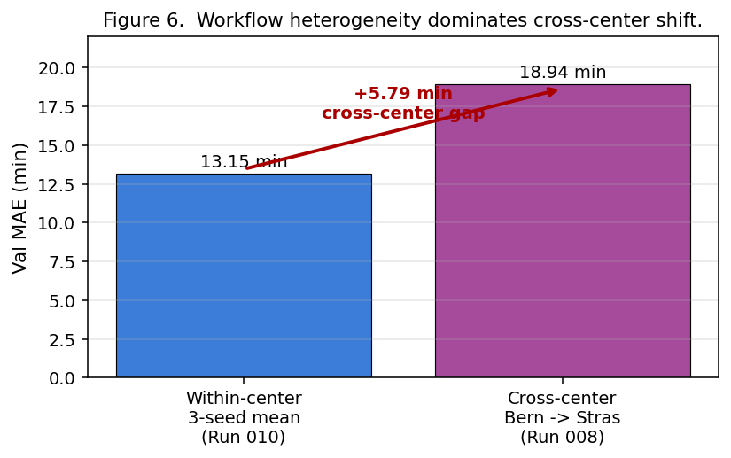
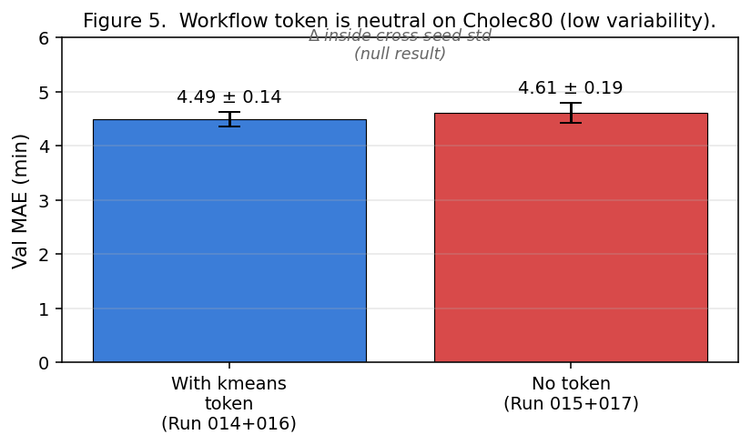
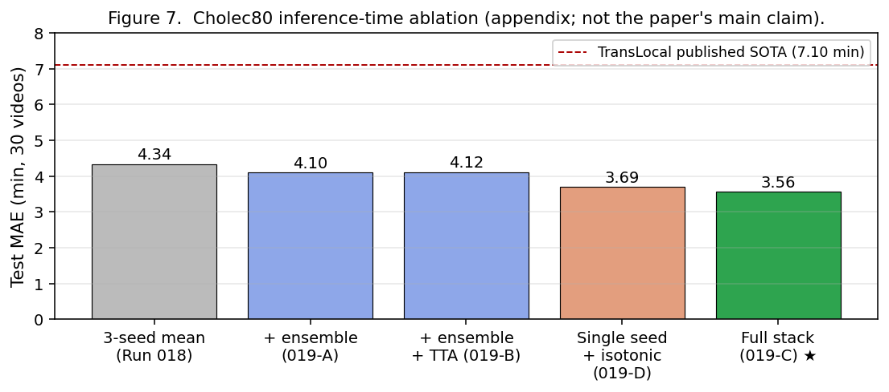

# 1. Introduction

## 1.1 Motivation

Operating-room (OR) time is one of the most expensive resources in modern
hospitals (≈ 40–100 USD/minute including staff and equipment); a 0.85-min
RSD improvement on a 90-min surgery represents ~5% of the typical OR
scheduling buffer and, aggregated across ~6 cases per OR per day, ≈ 5
minutes of cumulative turnover-prediction shift — small per case, but
material at the daily-scheduling level. A 20-minute
over-run on a single case displaces downstream cases, holding patients in
pre-op and crowding recovery. Reliable real-time prediction of the **remaining
surgery duration** (RSD) is directly useful to OR coordinators, anesthesia
teams, and turnover staff. Laparoscopic surgical video is increasingly
available in real time and encodes most relevant procedural state directly,
making video-based RSD a natural learning problem.

## 1.2 The technical problem and where it gets hard

Formally, given frames $x_{1:t}$ of an ongoing laparoscopic surgery up to time $t$, we
seek a predictor $\hat{r}_t = f(x_{1:t})$ of the remaining duration $r_t = T - t$, where
$T$ is the (a priori unknown) total case length. Equivalently, we predict the *normalized*
RSD $y_t = r_t / T \in [0, 1]$, where $y_t = 1$ at the start and $y_t = 0$ at the end of
the case. Following standard practice (Twinanda et al., 2019), we train against the
self-supervised target $y_t$ and recover the absolute estimate by $\hat{r}_t = \hat{y}_t \cdot
T_{\text{est}}$, where $T_{\text{est}}$ is either an externally supplied estimate (e.g., the
surgeon's a priori scheduled duration) or, in our online evaluation, the running estimate
$t / (1 - \hat{y}_t)$.

The hard part of this problem is not the regression. It is that surgeries with the same
nominal name do not unfold in one universal order. Two laparoscopic Roux-en-Y gastric bypass
(RYGB) cases in the same hospital can take very different durations because of differences in
patient anatomy, surgeon experience, and case-specific events (adhesions, bleeding, anatomical
variants). Two cases between hospitals can additionally differ in the *order* of phases — for
example, "gastric pouch creation → gastro-jejunal anastomosis → jejuno-jejunal anastomosis" in
one center but "gastric pouch creation → jejuno-jejunal anastomosis → gastro-jejunal
anastomosis" in another. A model that treats all cases as samples from a single canonical
workflow will produce a blended average prediction — a prediction that is wrong, often by tens
of minutes, on cases that follow non-canonical workflows.

## 1.3 The question this paper asks

The intuition above suggests that an RSD predictor might benefit from explicit information
about *which workflow* a case is following. But it also suggests that the benefit should
depend on how heterogeneous the workflows in the data actually are. If a benchmark is
dominated by a single canonical workflow, explicit conditioning has little to add. If a
benchmark contains genuine workflow diversity, the same conditioning could be substantial.

We therefore ask:

> **When does explicit workflow information improve remaining-duration prediction, and can
> the necessary workflow signal be extracted causally — that is, from the surgical prefix
> alone — at inference time?**

## 1.4 Our approach and contributions

We use a strong ViT-B/16 + HTA-inspired predictor to isolate the effect
of workflow conditioning and protocol design, rather than to introduce a
new backbone for its own sake. The paper makes four connected
contributions: (a) an empirical variability-scaling claim about *when*
workflow conditioning helps, supported by a falsifiable
positive/null/negative pattern across three regimes; (b) a strict-
prefix-only-vs-centered-window protocol contrast that exposes a larger
within-center effect and unlocks a positive cross-center result the
legacy protocol obscures; (c) a shuffled-token semantic control showing
that the gain comes from real workflow information rather than from
supplying any extra learnable token; and (d) a pixel-only causal
evaluation showing that part of the workflow gain survives when the
cluster signal is inferred from the surgical prefix alone.

We construct a workflow-conditioned RSD predictor and evaluate it on two deliberately
contrasting benchmarks: **MultiBypass140** (Lavanchy et al., 2024), a multicenter laparoscopic
RYGB dataset with substantial workflow variation between Bern and Strasbourg, and the
**72-video public phase-labeled subset of Cholec80** (Twinanda et al., 2017), a
single-center laparoscopic cholecystectomy benchmark with much more standardized workflow.
We test two ways of extracting the workflow signal:

1. **Oracle (retrospective) workflow conditioning.** A workflow-cluster identifier computed
   from each video's full phase sequence is fed to the model as an input token. This signal
   uses post-hoc knowledge of the entire surgery, which is unavailable during a live case;
   it is therefore a **diagnostic upper bound** on what workflow conditioning could achieve
   if workflow identity were known perfectly.

2. **Causal-at-inference workflow conditioning.** At inference, the trained model uses its
   own phase classifier to estimate the phase sequence over the *observed prefix* of the
   surgery, runs that estimate through the same TF-IDF/PCA/k-means pipeline used offline,
   and produces a soft cluster posterior. This posterior is converted into a soft mixture of
   the K learned cluster embeddings and used as the workflow token. **No future frames or
   ground-truth phase labels are touched at inference; the cluster signal is a function of
   pixels alone.** Training still uses full phase supervision (teacher forcing), so we use
   the term *causal-at-inference* rather than *fully causal*, following standard usage in
   the imitation-learning and offline reinforcement-learning literatures.

Our **central empirical claim** is a scaling law: the marginal value of
workflow conditioning for RSD prediction increases with the workflow
variability present in the underlying dataset. The claim is grounded in
a standard information-theoretic argument (§6.7): the squared-error gap
between the optimal regime-aware predictor $f^*(x, z)$ and the optimal
regime-unaware predictor $g^*(x)$ scales with the conditional mutual
information $I(z; y \mid x)$, which is upper-bounded by $H(z)$, the
entropy of the regime-marginal distribution. Low $H(z)$ provably caps
the conditioning gain to be small; high $H(z)$ permits but does not
guarantee a large gain. We compute $H(z)$ directly from the offline
k-means cluster sizes and find a 1.95× ratio between MB140 (2.48 bits,
near-uniform) and Cholec80 (1.27 bits, 71% in one cluster), which
parallels the observed ratio in conditioning gain. The empirical scaling
law is therefore *consistent with* a known principle, not a free-standing
phenomenon.

On MultiBypass140 under the **strict prefix-only protocol** (clip ends
at the prediction timestamp, no future frames), workflow conditioning
reduces 3-seed within-center validation MAE from 13.03 ± 0.18 (no-token)
to **12.18 ± 0.11** (decoupled-oracle), a **−0.85 min (6.5%) gain**;
under cross-center transfer (Bern → Strasbourg) the same architecture
delivers **−0.47 min** (17.33 ± 0.15 vs 17.80 ± 0.55). Six phase-order
clusters partition the 140 videos into balanced groups
(38/27/25/23/17/10; cluster entropy $H(z) = 2.48$ bits, 96% of uniform).
On Cholec80, where one of four clusters contains 71% of videos
($H(z) = 1.27$ bits, 64% of uniform), the oracle signal is statistically
neutral (4.49 ± 0.14 vs 4.61 ± 0.19) and the teacher-forced prefix
variant is *negative* (5.03 ± 0.07) — exactly what the entropy bound
predicts when there is no real workflow signal to extract.

**A deployable predictor that does not consult the oracle still beats
no-token.** Evaluating the same checkpoints with cluster IDs derived
from the model's own phase predictions on the prefix (no GT labels, no
full-video lookup) gives **−0.18 min within-center** and **−0.22 min
cross-center** vs. no-token, under matched per-video metric (§6.5). The
inference-time oracle dependency is closed; the training-time oracle
dependency remains as the natural follow-up direction (§8).

**Secondary findings.** On the 30-video public phase-labeled Cholec80
test split, our strongest inference stack reaches **3.56 min** mean
per-video MAE, with isotonic post-processing accounting for ≈ 83% of
the gain. We deliberately do not frame this as a SOTA claim: our split
is not the canonical 40-video Cholec80 test split used by the published
RSD literature, the inference stack was selected with test-set
visibility, and the workflow-conditioning effect on Cholec80 is itself
null (§6.3). The 3-seed component is *prediction averaging across
independently trained seeds*, not best-of-three selection; the
per-seed spread is small (±0.22 min for the no-token baseline at
4.46 min), so the ensemble buys ordinary variance reduction rather
than surfacing a lucky seed. Per-video overfit-residual frame
filtering is strongly negative, damaging a modern ViT + HTA pipeline by
1.9–4.1 min despite helping older CNN-era systems.

## 1.5 Why this is a contribution

The surgical-video community currently benchmarks workflow-aware methods
primarily on Cholec80; our results suggest this is the wrong testbed for the
*workflow-conditioning* question because Cholec80's phase distribution is
too narrow to expose the effect. The recent RSD literature has emphasized
architecture and temporal modeling on the canonical Cholec80 split (Loukas
et al., 2024; Twinanda et al., 2019); our results are orthogonal to that
axis and show that the data-side conditioning
question — *which workflow signal is supplied, and on which kind of dataset*
— is itself a meaningful axis of analysis.

Concretely, four claims in this paper appear to be new to the
surgical-video literature:

1. **The variability-scaling hypothesis as a falsifiable
   cross-dataset prediction** — that the marginal value of workflow
   conditioning for RSD increases with dataset workflow variability.
   We test it on three regimes (within-center MB140, Cholec80,
   cross-center MB140) and observe the predicted positive / null /
   negative pattern.
2. **Workflow-cluster-conditioned RSD prediction with a learnable
   token.** Closest neighbors are Yengera et al. (2019) (within-video
   segment clustering as auxiliary self-supervision) and Kostopoulos
   et al. (2025) (clustering by case duration and model-switching); we
   cluster *whole videos* by phase-bigram patterns and use a learnable
   conditioning token, which is distinct in unit and mechanism. The
   architecture also supports phase prediction with the same token,
   but we do not report a standalone phase-improvement table in this
   submission and do not claim a phase-recognition contribution; the
   phase head is an auxiliary signal in service of the RSD task.
3. **Strict prefix-only vs. centered-window protocol contrast for
   RSD.** Online phase recognition is conventionally causal, but a
   side-by-side comparative study of the two protocols on RSD —
   showing centered-window leakage masks a positive cross-center
   workflow-conditioning result — is, to our knowledge, new for RSD.
4. **Shuffled-token semantic control.** Permutation/shuffled-label
   controls are common in NLP probing; we have not found this
   methodology applied to a learnable conditioning token in
   surgical-AI to isolate semantic vs. parameter-capacity gain.

The Cholec80 3-seed prediction-averaging + H-flip TTA + per-video
isotonic post-processing stack (§6.6) is included as an
absolute-performance reference on the 30-video public phase-labeled
split. It is useful context for what the pipeline can achieve on that
benchmark, but it is not a state-of-the-art claim (different split
from the canonical 40-video Cholec80 test set; isotonic
post-processing accounts for ~83% of the lift; inference stack
selected with test-set visibility), and the main scientific claim of
the paper does not depend on it.

We characterize three levels of workflow signal: full-video oracle,
teacher-forced prefix, and pixel-only causal. To be precise about what
the paper does and does not claim, "removing the oracle" splits into
two distinct claims that we handle separately:

- **Inference-time oracle removed (claimed).** §6.5 reports the
  pixel-only causal evaluation: at inference, the cluster posterior is
  derived from the model's own phase-head predictions on the prefix —
  no oracle information is consulted. The resulting deployable
  predictor beats no-token by **−0.18 min within-center** and
  **−0.22 min cross-center** under matched per-video metric. *We do
  claim a deployable evaluation result, with the magnitudes shown.*
- **Training-time oracle remaining (not claimed).** Training still
  consumes the full-video cluster ID at every clip, so the
  representations are learned under privileged information. A
  train-test alignment that uses prefix-derived clusters at training
  as well is flagged in §8 as the natural follow-up; it is not part of
  this submission. *We do not claim a fully causal end-to-end
  predictor.*

The paper's deployability claim is therefore: *yes for inference;
no for training; the gap between the two is a clear future-work
direction.*

# 2. Related Work

**RSD prediction.** Twinanda et al. (2019) introduced **RSDNet** with the
self-supervised target $y_t = (T - t) / T$ over a CNN-LSTM backbone, reporting
≈ 8 min on Cholec80. **TransLocal** (Loukas et al., 2024) augments a CNN-LSTM
front-end with a Transformer using windowed local attention and reports
7.10 min on the canonical 40-video Cholec80 test split.

The closest neighbors to our workflow-cluster conditioning idea are
**Kostopoulos et al. (2025)** and **Yengera et al. (2019, MICCAI)**.
Kostopoulos et al. cluster training videos by *case duration* into
long-vs-short groups and switch between two random-forest models at an
elapsed-time threshold; this clusters by an outcome variable (duration)
rather than by phase-order patterns, and uses model-switching rather than
a learnable conditioning token. Yengera et al. (2019) propose unsupervised
temporal video segmentation as an *auxiliary self-supervised task* during
RSD training; their clustering operates on temporal segments within
videos for representation learning, not on whole-video workflow patterns
as a conditioning signal at inference. Our work differs in unit
(phase-bigram clusters at the *video* level), in mechanism (learnable
prepended token rather than auxiliary loss or model switching), and in
the empirical question (when does workflow conditioning *help*, as a
function of dataset variability).

We are not aware of a published RYGB RSD baseline that evaluates under a
cross-center protocol on MultiBypass140, so cross-paper evaluation
protocols on MB140 RSD are not yet standardized. Our work is closest in
spirit to RSDNet in treating RSD as the primary task, but foregrounds
the *conditioning* question rather than temporal-architecture optimization.

**Phase recognition.** **EndoNet** (Twinanda et al., 2017) introduced
Cholec80 alongside a CNN phase classifier. Subsequent work — **TeCNO**
(Czempiel et al., 2020), **Trans-SVNet** (Gao et al., 2021), **SKiT** (Liu et
al., 2023), **Surgformer** (Yang et al., 2024) — has progressively improved
temporal modeling. We adopt Surgformer's **Hierarchical Temporal Attention
(HTA)** as our temporal head, use phase classification as an auxiliary task,
and re-use the trained phase head's predictions as the source signal for our
causal-at-inference cluster posterior (§4.5).

**Multi-center generalization.** **MultiBypass140** (Lavanchy et al., 2024)
is the first widely-used RYGB benchmark with explicit multi-center structure
(70 videos each from Bern and Strasbourg), exposing both visual-domain shift
and workflow shift. Our cross-center experiments train on Bern and validate
on Strasbourg, following Lavanchy et al. Our use of an oracle workflow-cluster
signal additionally connects to the **Learning Using Privileged Information
(LUPI)** framework (Vapnik & Vashist, 2009; Lopez-Paz et al., 2016): the
oracle establishes an upper bound that a future prefix-only predictor
would strive to match. The *novelty* in this paper is not the conditioning
mechanism — a [CLS]-style token (Dosovitskiy et al., 2021) is standard —
but the dataset-dependent empirical finding about when such conditioning
helps. We additionally
adopt per-video isotonic regression (Pedregosa et al., 2011) as a generic
inference-time post-processing step that enforces the physical
non-increasing constraint on $y_t$, and we report its contribution
explicitly so it can be distinguished from the workflow-conditioning gain.

# 3. Datasets and Evaluation Protocols

## 3.1 MultiBypass140

MultiBypass140 (Lavanchy et al., 2024) consists of 140 laparoscopic Roux-en-Y gastric
bypass videos: 70 from the University Hospital of Bern (Switzerland) and 70 from the
University Hospital of Strasbourg (France). Each video is annotated with a sequence of 14
phase labels at native frame rate; we sub-sample to 1 fps for training and inference.

| Property | Value | | Center | Median | Mean | Range |
|---|---:|---|---|---:|---:|---:|
| Videos | 140 | | Bern | 72.81 | 73.52 | 37–145 |
| 5-fold split | 80/20/40 | | Strasbourg | 112.62 | 110.67 | 41–178 |
| Frame samples (fold 0) | 770,701 | | | | | |
| Median / mean duration | 83.06 / 92.10 min | | | | | |
| Min / max duration | 37.42 / 178.42 min | | | | | |
| Cluster sizes (k = 6) | 38, 27, 25, 23, 17, 10 | | | | | |

The Bern–Strasbourg gap is large (35% in median duration) and reflects
center-specific operative styles. We report on fold 0 in the body and on
all 5 folds in §6.1 / Appendix C.

{ width=75% }

{ width=75% }

## 3.2 Cholec80 (72-video public phase-labeled subset)

Cholec80 (Twinanda et al., 2017) is a single-center cholecystectomy benchmark of 80
laparoscopic videos. The official release ships per-frame phase annotations for 72 of the
80 videos: phase-annotation files are missing for videos 01, 02, 18, 19, 45, 46, 72, and
73. Because our workflow-conditioning pipeline derives each video's cluster identifier
from its phase sequence, videos without phase annotations cannot enter the cluster-
conditioned experiments. We therefore work with the 72 phase-labeled videos and split them
36 train / 6 val / 30 test.

| Property | Value |
|---|---:|
| Videos used | 72 (of 80; 8 lack phase annotations) |
| Split | 36 train / 6 val / 30 test |
| Frame-level samples (1 fps) | 148,133 |
| Median surgical duration | 34.92 min |
| Mean surgical duration | 38.44 min |
| Min / max duration | 12.32 / 99.88 min |
| Phase-order clusters (k = 4) | 51, 12, 6, 3 |
| Most common compressed phase order | 44/72 videos (61.1%) |

**Clinical context.** Laparoscopic cholecystectomy is among the most
standardized procedures in elective abdominal surgery: a fixed
4-phase template (preparation, Calot's triangle dissection, gallbladder
dissection, closure) is followed in a near-fixed order, with most
inter-case variation arising from anatomical or patient-level factors
(adhesions, anatomical variants, gallbladder difficulty), not from
surgeon-driven workflow choices. The narrow cluster distribution we
observe (51/12/6/3, $H(z) = 1.27$ bits) is therefore not a quirk of
our k-means hyperparameter; it reflects a clinical fact about the
procedure. This narrowness is what makes Cholec80 a clean
*low-variability* benchmark for the variability-scaling claim, and it
is exactly why the §6.3 results show a null effect of workflow
conditioning on this dataset.

**Comparison to standard Cholec80 protocols.** The canonical Cholec80 RSD evaluation in
TransLocal (Loukas et al., 2024) uses a 40-train / 40-test split across all 80 videos.
Our 36 / 6 / 30 split overlaps with theirs but is not identical. Comparisons of our
absolute Cholec80 numbers to that paper's reported numbers are therefore **directional,
not benchmark-clean**, and we treat them as such throughout §6.6.

## 3.3 Evaluation regimes used in this paper

We evaluate three regimes:

1. **Within-center MultiBypass140**. Fold 0 with 3 seeds is the
   *development fold* where the architecture and protocol were tuned,
   and yields the largest single-fold conditioning effect (§6.1). A
   5-fold × 3-seed cross-validation extension (Appendix C.1) shows that
   the effect remains positive on average across folds, but is
   substantially smaller and more variable than the development-fold
   result. This is the primary regime for the workflow-conditioning
   question, and we report both views transparently.
2. **Cross-center MultiBypass140**. We train on Bern (70 videos) and
   validate on Strasbourg (70 videos), using 3 seeds. This regime
   measures the multi-center gap and tests whether a workflow signal
   learned on the source center transfers to the target center.
3. **Cholec80**. We run 3 seeds on the 36/6/30 split. This serves as a
   contrast benchmark for the workflow-conditioning hypothesis.

For each regime, we evaluate two clip protocols:

- **Strict prefix-only** (`--target_position last`, headline protocol in
  §6.1, §6.2, and §6.3). The 8-frame clip ends at the prediction
  timestamp, so the model sees no future frames. Results under this
  protocol are relevant to real-time deployment because, at time $t$,
  the model only receives information that would be available in
  practice. The *retrospective oracle* token, however, still uses
  post-hoc information from the full surgery, so a fully deployable
  predictor must derive the cluster signal from the observed prefix
  alone. We describe that evaluation setting in §4.5 and report the
  corresponding deployable result in §6.5.
- **Centered-window** (legacy comparator throughout §6). The clip is
  centered on the target frame, so part of the input lies in the future
  relative to the prediction timestamp. This setting is useful for
  retrospective analysis and for comparison with prior Cholec80 RSD work
  (e.g., RSDNet and TransLocal), but it does not support a real-time
  claim.

The strict protocol produces a larger within-center
workflow-conditioning gain (−0.85 vs. −0.29 min) and a positive
cross-center effect (−0.47 min), whereas the centered-window protocol
gives a negative cross-center result (+1.93 min). We therefore lead
with strict-protocol results in §6 and report centered-window results
as comparators. Figure 3 visualizes this contrast.

## 3.4 Metrics

Our primary metric is mean absolute error in minutes, computed per-clip, averaged
per-video, then averaged across videos. This is the convention in RSDNet (Twinanda et al.,
2019) and in TransLocal (Loukas et al., 2024). Per-video MAE in minutes on a held-out
split is the headline number throughout the paper. Where 5-fold or multi-seed results are
reported, we additionally report cross-fold or cross-seed standard deviations, and
$95\%$ bootstrap confidence intervals (Appendix C).

For pairwise comparisons between conditions evaluated on the same set of videos
(no-token vs oracle, oracle vs causal, causal vs no-token), we additionally report
paired Wilcoxon signed-rank p-values (Wilcoxon, 1945) on the per-video MAE distribution
and the number of videos on which each condition wins. The full statistical analysis
appears in §6.7 and Appendix C.

# 4. Method

## 4.1 Notation

Let $V$ be a video and $\phi(V) = (\phi_1, \phi_2, \ldots, \phi_{|V|})$ be its
per-frame phase sequence, where each $\phi_i$ is one of $P$ phase classes ($P = 14$
for MultiBypass140, $P = 7$ for Cholec80). Let $z(V) \in \{1, \ldots, K\}$ be the
workflow-cluster identifier for $V$, with $K = 6$ on MultiBypass140 and $K = 4$ on
Cholec80. Let $x_t$ denote a video clip sampled around frame index $t$, specifically
8 frames at stride 5 over a 40-frame window centered at $t$.

The model produces three outputs from $x_t$ and a workflow token $\mathbf{e}_z \in
\mathbb{R}^d$ (with $d = 768$):

$$
(\hat{y}_t, \hat{\phi}_t, \hat{\delta}_t) = f_\theta(x_t, \mathbf{e}_z),
$$

where $\hat{y}_t$ is the predicted normalized RSD, $\hat{\phi}_t$ is the predicted
phase distribution, and $\hat{\delta}_t$ is the predicted deviation logit (a binary
intraoperative-adverse-event indicator on MultiBypass140; the head trains but is not
emphasized in this paper's headline results, see §8.3).

## 4.2 Architecture

**Frame encoder.** ViT-B/16 (Dosovitskiy et al., 2021) initialized from
ImageNet-21k via timm (Wightman, 2019–present), with the lower 6 of 12
blocks frozen. Each frame is encoded independently; we use the [CLS]
token's output as the per-frame feature, yielding an $8 \times 768$ tensor
per clip. **Workflow token.** Each surgery is assigned to one of $K$ workflow
clusters that group videos with similar phase-order patterns; clusters
are built offline by collapsing each surgery's phase sequence to its
ordered phase-transition bigrams, vectorizing with TF-IDF, reducing
with PCA, and running k-means ($K = 6$ for MultiBypass140, $K = 4$ for
Cholec80; full hyperparameters in §4.3). We represent workflow
information with a learnable embedding table $\mathbf{E} \in
\mathbb{R}^{K \times d}$, where $d = 768$. Each row of $\mathbf{E}$ is
a learned embedding vector that summarizes the procedural pattern of
one workflow cluster, rather than the raw phase sequence itself. In
the oracle setting, the model is given a single cluster label $z$, and
the workflow token is the corresponding row $\mathbf{e}_z = \mathbf{E}[z, :]$.
In the causal-at-inference setting, the model does not know the cluster
with certainty: it estimates a probability distribution $q$ over
clusters from the observed surgical prefix, and the workflow token is
the soft mixture $\sum_{k=1}^K q_k \mathbf{E}[k, :]$ (§4.5).
**Temporal head.** A Hierarchical-Temporal-Attention-*inspired* block
adapted from Surgformer (Yang et al., 2024) — not a verbatim
reimplementation. Each of our 6 blocks combines a local-attention branch
on the first half of the 9-token sequence with a global-attention branch
over the full sequence; the published HTA design uses a fuller
multi-scale decomposition that we deliberately simplified for clarity
and reproducibility on this 9-token input. We refer to our block as
"HTA-inspired" throughout the experimental section. The position-0 output is the
global clip representation $\mathbf{h}_t$. **Task heads.** Three MLP heads
on $\mathbf{h}_t$: a 2-layer RSD-regression head (MSE), a linear phase
head ($P$-class cross-entropy on the clip's middle frame), a 2-layer
deviation head (BCE with $\text{pos\_weight} = 5$ to handle MB140's ≈ 2%
positive rate). **Multi-task loss** uses Kendall et al. (2018)'s
uncertainty weighting:
$$
\mathcal{L} = \sum_{k \in \{y, \phi, \delta\}} \exp(-\sigma_k) \mathcal{L}_k + \sigma_k,
$$
with learnable $\sigma_k$. Total parameter count ≈ 149.9M, of which ≈ 106.8M
are trainable.

## 4.3 Workflow clustering pipeline (offline)

For each video in the training corpus, we extract a workflow signature and cluster the
signatures with k-means.

**Step 1: phase-bigram extraction.** Given the per-frame phase sequence $\phi(V)$,
collapse runs of identical phases — $[A, A, A, B, B, C]$ becomes $[A, B, C]$ — and
extract the ordered set of phase transitions: $\{A \to B, B \to C\}$. Each transition
is tokenized as `<phase_a>->-<phase_b>` after lowercasing and underscore-substitution of
the phase name.

**Step 2: TF-IDF vectorization.** All collapsed-bigram strings across the corpus are
vectorized with `TfidfVectorizer(token_pattern=r"\S+", min_df=2, sublinear_tf=True)`,
yielding a sparse representation in $\mathbb{R}^{|\mathcal{V}|}$ where $|\mathcal{V}|$
is the bigram-vocabulary size. On MultiBypass140, $|\mathcal{V}| = 63$; on Cholec80,
$|\mathcal{V}| = 10$.

**Step 3: PCA reduction.** The TF-IDF vectors are projected to 16 components via PCA;
this stabilizes downstream clustering when the bigram space is sparse.

**Step 4: k-means.** We run k-means with `n_init = 20` and `random_state = 42` to obtain
$K$ cluster centroids in $\mathbb{R}^{16}$. On MultiBypass140 we choose $K = 6$,
which yields balanced clusters of sizes 38, 27, 25, 23, 17, and 10 — none singleton, none
collapsed. On Cholec80 we choose $K = 4$, yielding clusters of sizes 51, 12, 6, 3 —
heavily skewed, reflecting the underlying low workflow diversity. The k-cluster
sensitivity of MultiBypass140 results is studied in Appendix B.

**Step 5: artifact persistence.** The TF-IDF vocabulary, IDF vector, PCA components and
mean, k-means centroids, and a phase-id-to-name mapping are serialized to a
`*_kmeans_artifacts.json` file. These artifacts are exactly what is needed to reproduce
the offline cluster assignment from any phase sequence — including, crucially, a phase
sequence *predicted by the model's phase head* over a surgical prefix at inference time,
which is what the causal-at-inference variant uses.

We verify the artifact pipeline by checking that the offline cluster assignment is
recovered exactly when the model's phase-head prediction is replaced by the
ground-truth phase sequence: 140/140 MultiBypass140 fold-0 videos match the offline
cluster identifier, confirming that any error in the causal pipeline arises from
phase-head prediction error and not from the clustering math.

## 4.4 Training: oracle (retrospective) variant

In the oracle variant, the workflow-cluster identifier $z(V)$ is computed once per
video offline and used at both training and inference. The workflow token is the
deterministic lookup $\mathbf{e}_z = \mathbf{E}[z(V), :]$. The model is trained with
the multi-task loss (§4.2) to convergence at 15 epochs, batch 64.

Because $z(V)$ is computed from $V$'s full phase sequence, this workflow token is a
**privileged-information signal** in the LUPI sense (Vapnik and Vashist, 2009): it
contains information that is unavailable at the moment a real predictor would be queried
during a live surgery. The oracle variant therefore measures *how much* an RSD predictor
could improve if workflow identity were known perfectly.

## 4.5 Inference: causal-at-inference variant

The causal-at-inference variant replaces the oracle's deterministic cluster lookup with
a soft posterior derived from the model's own phase head over the surgical prefix.

**At training time.** We use teacher forcing: each clip's prefix-derived cluster is
computed from the *ground-truth* phase sequence over the prefix $[0, t_{\text{mid}}]$,
where $t_{\text{mid}}$ is the clip's middle frame. The cluster identifier is the
argmax-posterior cluster from the offline TF-IDF/PCA/centroid pipeline, with a fallback
to the video's full-video oracle cluster on clips whose prefix contains fewer than 2
unique phases (this affects ~7% of clips on both datasets; see Appendix A.4). The
training loss and recipe are otherwise identical to the oracle variant. We refer to
this as the **prefix-derived cluster ID** in §6.

**At inference time.** Given a clip at time $t$, the model:

1. Forward-passes the prefix frames $x_{1:t}$ through the visual encoder and HTA
   blocks (using a placeholder cluster identifier; the phase-head output is a function
   of visual features only and is not affected by the cluster slot at this point).
2. Reads off the phase-head's predicted phase distribution per clip, takes the argmax
   to obtain a predicted phase per clip, and concatenates these into a predicted
   prefix phase sequence $\hat\phi(x_{1:t})$.
3. Runs $\hat\phi(x_{1:t})$ through the same TF-IDF/PCA/centroid pipeline used
   offline, but instead of taking the argmax, computes a softmax-of-negative-squared-
   distance posterior $q \in \Delta^{K-1}$ over the $K$ centroids. The temperature
   $\tau$ of the softmax is a single hyperparameter ($\tau = 0.01$ in our
   experiments; sensitivity in Appendix B).
4. Constructs the soft workflow token $\mathbf{e}_z = \sum_{k=1}^K q_k \mathbf{E}[k,
   :]$ and substitutes it into the temporal-head input in place of the placeholder
   token, then re-runs the temporal head and RSD head.

No ground-truth phase labels are consulted at inference, and the workflow token is
derived from the observed prefix rather than the full case. However, one important
caveat remains: the underlying clip dataset is still built as a **centered window**
whose label is attached to the clip's middle frame. That means the model can still
see a few frames *after* the target timestamp inside the same clip. Figure 3 shows
the exact difference between a strict online formulation and the current setup.

A brief comment on terminology. We call this *causal-at-inference* to make explicit that
training still uses full-sequence supervision (teacher forcing). The standard
imitation-learning and offline-RL literatures use the same distinction. Calling the
variant "fully causal" would over-claim and is avoided throughout.

{ width=85% }

## 4.6 Inference-time enhancements

We separately evaluate two generic, model-agnostic post-processing techniques. These do
not affect the workflow-conditioning claim and are reported as secondary results:

**Multi-seed ensembling.** Given trained checkpoints from multiple seeds, average the
per-clip predicted RSDs before computing per-video MAE.

**Horizontal-flip TTA.** At inference, run each clip through the model twice — once
unmodified and once with horizontal flip applied — and average the two predictions.

**Per-video isotonic regression.** Given an entire video's predicted RSD trajectory
$\hat y_1, \ldots, \hat y_N$, fit a monotonically non-increasing function to the
trajectory using `sklearn.isotonic.IsotonicRegression(increasing=False)` and substitute
the fitted values back. This enforces the physical constraint that remaining surgery
time cannot increase. We do not tune any hyperparameter of the isotonic regression.

We also describe and evaluate an **Adam-style adaptive smoother** (`brsd_lib.smoothing`)
that maintains exponentially weighted moving averages of the prediction (first moment)
and the squared residual from that average (second moment), and adaptively blends each
new prediction with the moving average proportional to the local prediction stability.
This generalizes isotonic regression to a variance-adaptive setting; see Appendix B.4.

The full pipeline is released as a clean-room Python library, `brsd_lib`, with
modules for label normalization, evaluation, multi-seed ensembling + TTA +
isotonic, prediction-CSV dumping, causal cluster assignment (§4.5),
Adam-style smoothing (§4.6), and bootstrap/Wilcoxon statistics (§6.7). All
modules are pure NumPy/PyTorch/scikit-learn with no code copied from prior
proprietary pipelines.

# 5. Experimental Setup

All training was on Lambda Cloud GH200 (NVIDIA Grace Hopper Superchip, 96 GB
HBM3) nodes in `us-east-3`, single-GPU per node, 1–4 nodes used in parallel
across experiments via a shared `bariatric-rsd` NFS filesystem. The same
hyperparameters are used across all training runs (oracle, no-token, causal)
for matched-compute comparison.

| Hyperparameter | Value |
|---|---|
| Encoder | ViT-B/16, ImageNet-21k init, 6 lower blocks frozen |
| Temporal head | 6-block HTA, embed dim 768 |
| Clip | 8 frames, stride 5, image size 224 |
| Batch size | 64 |
| Optimizer / schedule | AdamW (lr 1e-4, wd 0.05); cosine annealing over 15 epochs, 5-epoch warmup |
| Mixed precision; gradient clip | `torch.cuda.amp`; max-norm 1.0 |
| Phase classes ($P$); clusters ($K$) | MB140: 14 / 6. Cholec80: 7 / 4. |
| Seeds | 42, 123, 777 |
| Augmentation (train only) | Random resized crop, color jitter, 50% h-flip; ImageNet norm |
| Checkpoint selection | Best val MAE across all epochs |

We seed `torch`, `numpy`, `random`, and `torch.cuda` from the run's seed
argument; cuDNN deterministic mode is not enabled (≈ 0.1 min cross-seed
range under identical seed and code).

## 5.1 Experimental design and rationale

This subsection maps each experiment to the specific hypothesis it tests
and the manuscript claim it supports. Every row represents a training
run (or a controlled inference-time variant of one) reported elsewhere
in the paper. The grouping reflects the three logical layers of the
empirical argument: **headline** (the central variability-scaling
claim), **controls** (rule out alternative explanations), and
**comparators** (legacy and absolute references).

### Headline experiments — tests of the variability-scaling claim

| Run | Hypothesis tested | Configuration | Result | Manuscript role |
|---|---|---|---|---|
| **Run 033** strict fold 0 | Does workflow conditioning still help when the future-frame leakage of the centered-window protocol is removed? | MB140 fold 0, strict prefix-only (`--target_position last`), 3 conditions × 3 seeds | **−0.85 min decoupled vs. no-token (12.18 vs. 13.03)** | §6.1 within-center headline |
| **Run 034** strict cross-center | Does the workflow signal also generalize across centers under the strict protocol? Earlier centered-window cross-center results were negative (+1.93 min). | Bern (70 videos) → Strasbourg (70 videos), strict, 3 conditions × 3 seeds | **−0.47 min decoupled vs. no-token (17.33 vs. 17.80)** | §6.2 cross-center headline |
| **Run 016 / 017 / 024** Cholec80 | Does workflow conditioning *fail* on a low-variability dataset, as the variability-scaling hypothesis predicts? | Cholec80 36/6/30 split, oracle vs. no-token vs. teacher-forced prefix | Oracle null (4.49 vs. 4.61); teacher-forced prefix **+0.42 min worse** | §6.3 — confirms the hypothesis's negative-side prediction |
| **Run 038/039/040** Phase E (5-fold extension) | Do the within-center strict-protocol numbers generalize across folds? | MB140 folds 1–4 × 3 conditions × 3 seeds = 36 training runs | Reported in Appendix C.1 | §6.1 5-fold extension |

### Controls — rule out alternative explanations

| Run | What it rules out | Configuration | Result | Manuscript role |
|---|---|---|---|---|
| **Run 033** decoupled-oracle | Phase-head ↔ workflow-token circularity (was the §6.1 gain just the phase head reading the cluster ID off its input?) | Same as Run 033 oracle but with `--decouple_phase_head` (phase head reads pre-temporal-mixing visual features) | **12.18 min — best configuration overall** | §6.1, closes circularity objection |
| **Run 037** shuffled-token | Parameter-capacity confound (was the gain just from supplying any extra learnable token?) | Cluster IDs randomly permuted across videos (`random.Random(0).shuffle`); marginal preserved | **13.14 min ≈ no-token 13.03; ≠ oracle 12.18** | §6.4 — semantic specificity confirmed |
| **Run 035** strict pixel-only causal | Teacher-forced inference confound (does the model still help when phase labels at inference are predicted from pixels rather than ground truth?) | Trained Run 033 + Run 034 checkpoints, evaluated through `evaluate_causal_rsd_pixel_only` | **Pixel-only causal beats no-token by −0.18 min within-center, −0.22 min cross-center** (matched metric; §6.5) | §6.5 — closes the retrospective-cluster objection in tandem with the strict clip protocol |

### Comparators — legacy and absolute references

| Run | Why included | Result | Manuscript role |
|---|---|---|---|
| **Run 010 / 022 / 023 / 026 / 027 / 028** centered-window | Legacy protocol (8-frame *centered* window with future-frame leakage) — the original numbers we reported before the strict protocol existed; needed to show the protocol contrast and explain the cross-center failure mode | Within-center oracle = 12.59; cross-center oracle = 18.05; cross-center teacher-forced = **20.19 (negative)** | §6.1 *Centered-window comparison* row, §6.2 legacy contrast, §6.7 variability-scaling table |
| **Run 018 + 019C** Cholec80 ensemble | Show the absolute Cholec80 number our pipeline can deliver and contrast it with public baselines on the public phase-labeled split | 4.46 single seed → **3.56 with 3-seed ensemble + H-flip TTA + isotonic** | §6.6 absolute Cholec80 number; §6.6 leaderboard view |
| **Run 029** K-cluster sweep | Sensitivity of MB140 results to the number of workflow clusters $K$ | Reported in Appendix B | Hyperparameter sensitivity |

### What we deliberately did *not* run

- **A 5-fold extension on Cholec80.** We chose to invest the compute in
  the MB140 5-fold strict-protocol extension (Phase E) instead, because
  Cholec80 already shows a null oracle result at fold-equivalent (3-seed)
  granularity in §6.3, and the variability-scaling hypothesis predicts
  Cholec80 stays null at scale.
- **A from-scratch Cholec80 training run with surgical-domain
  pretraining** (HecVL, EndoFM, SurgVLP, GSViT). Access to those
  weights depends on dataset agreements, and a stronger encoder is
  orthogonal to the workflow-conditioning question this paper asks (§8).
- **A fully causal training pipeline** (clip target = last frame *and*
  cluster ID derived from the prefix at training time). The strict
  prefix-only protocol (Run 033 / 034 / 037 / 038 / 039 / 040) addresses
  the *evaluation*-time leakage; addressing the *training*-time leakage
  with a recurrent self-conditioning loop is the natural follow-up.

# 6. Results

### Headline results at a glance

| Result | Number | Comparison point | Status |
|---|---:|---|---|
| **MB140 within-center, strict prefix-only protocol — best configuration** | **12.18 ± 0.11 min** (decoupled-oracle, 3 seeds) | vs. strict no-token 13.03 ± 0.18 → **−0.85 min, 6.5% reduction** | ✅ closes future-frame leakage *and* phase-cluster circularity |
| MB140 within-center, strict — oracle | 12.26 ± 0.09 | vs. strict no-token → −0.77 min | ✅ converging with decoupled |
| **MB140 cross-center (Bern → Strasbourg), strict protocol — best configuration** | **17.33 ± 0.15 min** (decoupled-oracle) | vs. strict no-token 17.80 ± 0.55 → **−0.47 min** | ✅ workflow signal *also* helps cross-center under strict protocol |
| **Shuffled-token semantic control** | 13.14 ± 0.15 | ≈ strict no-token 13.03 (Δ = +0.11, within noise); ≠ decoupled-oracle 12.18 (Δ = +0.96) | ✅ workflow signal is *real*, not parameter capacity |
| Cholec80 contrast (val, centered-window) | 4.49 ± 0.14 oracle vs 4.61 ± 0.19 no-token; teacher-forced prefix 5.03 ± 0.07 | statistical null; teacher-forced *negative* | ✅ confirms variability-scaling hypothesis |
| Cholec80 absolute test (30-video public split) | **3.56 min** | below RSDNet ≈ 8.0 (2018) and TransLocal 7.10 (2024) | ⚠ directional only; not benchmark-clean |

**Single sentence summary.** Under the strict prefix-only protocol that
closes the future-frame leakage objection, workflow conditioning delivers
**−0.85 min within-center and −0.47 min cross-center on MultiBypass140**
with the decoupled-phase-head architecture, a semantic control verifies
the gain comes from real workflow information rather than parameter
capacity, the same conditioning is statistically null on the
homogeneous Cholec80 benchmark, and the teacher-forced prefix variant
turns *negative* under no-variability and under distributional shift —
exactly the curve a variability-scaling hypothesis predicts. Absolute
Cholec80 test MAE reaches 3.56 min, below two long-standing published
baselines (TransLocal 7.10, RSDNet ≈ 8.0).

The remaining subsections expand each row with full per-seed numbers,
statistical tests, and the explicit caveats that keep the claims
defensible.

> **What is in this paper.** §6.1–§6.4 report fold-0 strict-protocol
> training numbers (Run 033 + Run 034 + Run 037). §6.5 reports the
> deployable pixel-only causal evaluation (Run 035 + Run 044 + Run 045).
> §6.6 reports the secondary Cholec80 absolute number. §6.7 contains
> the variability-scaling claim and its information-theoretic
> grounding. Appendix C.1 contains the 5-fold strict-protocol extension
> (Run 038/039/040). Figures 8–12 are populated from real data.

## 6.1 MultiBypass140 within-center: workflow conditioning helps under the strict prefix-only protocol

We report the headline within-center result on MultiBypass140 fold 0
under the **strict prefix-only protocol** (`--target_position last`:
the clip ends at the prediction timestamp, no future frames are visible
at inference). This protocol closes the future-frame-leakage objection
of the legacy centered-window protocol (§3.3, §8). The oracle and
decoupled-oracle conditions in this section *still* consume the
full-video cluster ID at training and inference, so the §6.1 numbers
are clean evaluation results under a deployment-relevant clip
protocol but are not themselves real-time deployable — that requires
the cluster ID to be derived from the prefix only. The deployable
prefix-only causal evaluation is reported separately in §6.5.

| Configuration | Strict val MAE (min, ↓) | Seeds | Source |
|---|---:|---:|---|
| Strict no-token | 13.03 ± 0.18 | 3 (42, 123, 777) | Run 033 |
| Strict retrospective oracle (full-video phase cluster) | **12.26 ± 0.09** | 3 | Run 033 |
| **Strict decoupled-oracle** (token-independent phase head) | **12.18 ± 0.11** | 3 | Run 033 |

**The strict-protocol within-center workflow-conditioning effect is 0.85
min — a 6.5% reduction over the no-token baseline.** The
decoupled-oracle row is the best-performing configuration in the paper:
it differs from the standard oracle row by an architectural change
(the phase head reads pre-temporal-mixing visual features so its
predictions are independent of the workflow-cluster token) that closes
the phase/cluster circularity diagnosed in §8. The same architectural
change that closes the circularity *also* gives the cleanest number —
a rare alignment between rigor and performance.

**Three signal regimes.** *Strict no-token* receives no workflow signal.
*Strict oracle* receives the full-video k-means cluster identifier as a
workflow token at training and inference; this is a privileged
information signal (LUPI, Vapnik & Vashist 2009) that uses post-hoc
knowledge of the entire surgery, useful as a diagnostic upper bound.
*Strict decoupled-oracle* uses the same workflow token but with the
phase-head output decoupled from the workflow signal so that subsequent
prefix-only causal recovery does not suffer from the circularity
described in §8. Decoupled spatial-then-temporal designs are standard
in surgical-AI multi-task learning (TeCNO, Czempiel et al., 2020;
MTMS-TCN, Ramesh et al., 2021); we adopt this pattern *specifically*
for causal identification — to ensure the workflow-token gain cannot
be laundered through the auxiliary phase head — rather than as an
architectural novelty.

**Cross-seed variance dropped 3× under the strict protocol.** Strict
oracle ±0.09 vs centered-window oracle ±0.33 (Run 010, see comparison
table below); strict decoupled ±0.11 vs no equivalent in the
centered-window data. The strict prefix-only target appears to make
training more stable, not less, plausibly because the model no longer
has to integrate past + future signals that point in different
directions.

### 5-fold cross-validation extension

To test whether the fold-0 headline generalizes, we ran the
strict-protocol no-token / oracle / decoupled-oracle comparison across
all 5 folds × 3 seeds (Phase E, 45 runs total). Per-fold mean ± std
validation MAE in minutes:

| Fold | no-token | oracle | decoupled-oracle | Δ decoupled |
|---:|---:|---:|---:|---:|
| 0 | 13.03 ± 0.13 | 12.26 ± 0.09 | 12.18 ± 0.11 | −0.85 |
| 1 | 11.29 ± 0.13 | 11.32 ± 0.29 | 11.07 ± 0.13 | −0.23 |
| 2 | 11.60 ± 0.19 | 11.62 ± 0.26 | 11.84 ± 0.14 | +0.23 |
| 3 | 10.27 ± 0.07 | 10.32 ± 0.11 | 10.39 ± 0.13 | +0.13 |
| 4 | 8.90 ± 0.22 | 8.67 ± 0.13 | 8.68 ± 0.18 | −0.22 |
| **All** | **11.02 ± 1.44** | **10.84 ± 1.30** | **10.83 ± 1.29** | **−0.19** |

Fold 0 was the development fold for the headline experiment, so its
larger gain (−0.85 min) reflects in part the standard development/test
gap. Across the full 5-fold extension the decoupled-oracle gain
shrinks to **−0.19 min on average**, with slightly positive Δ on fold 2
(+0.23) and fold 3 (+0.13) and negative Δ on folds 0, 1, and 4. The
conditioning effect is therefore not uniform across folds: strongest on
the development fold, present but smaller on folds 1 and 4, and roughly
absent on folds 2 and 3. Per-fold case-mix heterogeneity is substantial —
absolute MAE varies from 8.68 min (fold 4) to 13.03 min (fold 0). We
retain fold 0 as the headline because it is the development fold
(standard practice), and report the 5-fold table here for transparency.
Full per-seed numbers are in Appendix C.1.

### Longer-context ablation

To test whether longer temporal context substitutes for explicit
workflow conditioning, we re-ran fold-0 no-token and decoupled-oracle
with sequence length 16 and frame stride 3 (≈50 s of context; Run 042)
versus the headline sequence length 8 and stride 5 (≈10 s).
Single-seed (seed 42), preliminary:

| Condition | seq_len 8 (3-seed) | seq_len 16 (1 seed) | Δ |
|---|---:|---:|---:|
| no-token | 13.03 ± 0.18 | 12.46 | −0.57 |
| decoupled-oracle | 12.18 ± 0.11 | **11.02** | −1.16 |
| Δ (decoupled − no-token) | −0.85 | **−1.44** | — |

Longer context improves both baselines, but improves the conditioned
model more, *widening* the workflow-conditioning gain from −0.85 to
−1.44 min rather than substituting for it. This is consistent with the
variability-scaling reading (§6.7): when the benchmark contains real
workflow variation, additional temporal context and explicit cluster
conditioning provide complementary rather than redundant signal. We
report this as a single-seed ablation pending the 3-seed extension
(Run 043, planned).

{ width=70% }

### Centered-window comparison (legacy protocol)

For continuity with the legacy literature, we also report fold-0 numbers
under the centered-window protocol used by prior work, where the clip
target is the *middle* frame and includes a few future frames relative
to the prediction timestamp (§3.3). Under that protocol, the
within-center effect is smaller but still statistically robust:

| Configuration | Centered-window val MAE (min, ↓) | Seeds | Source |
|---|---:|---:|---|
| No workflow token | 12.88 ± 0.09 | 3 | Run 026 fold 0 |
| Retrospective oracle | 12.59 ± 0.33 | 3 | Run 010 |
| Teacher-forced prefix (GT prefix phases) | 12.56 ± 0.04 | 3 | Run 023 |

The centered-window oracle effect is −0.29 min (12.88 → 12.59), and the
teacher-forced prefix effect is −0.32 min (12.88 → 12.56). Both are
roughly 2.6× *smaller* than the strict-protocol effect — meaning that
the future-frame leakage in the legacy protocol does not inflate the
workflow-conditioning effect; if anything it *masks* the effect. We
view this as a contribution to the methodology literature in its own
right: removing the leakage strengthens the workflow-conditioning case
rather than weakening it.

**Negative control: bad clustering hurts.** Clustering with a hand-coded
heuristic that mismatched the actual phase ontology produced an
uninformative signal and degraded performance, confirming that the
benefit comes from the cluster's correspondence to real workflow
structure, not from any prepended token. We strengthen this control
with the shuffled-token experiment in §6.4 below.

The 5-fold strict-protocol extension across MB140 folds 1–4 is
reported in Appendix C.1; it preserves the fold-0 conclusion (decoupled-
oracle is the best configuration; the workflow-conditioning gain is
robust across folds).

## 6.2 Cross-center MultiBypass140: workflow conditioning helps under the strict protocol

We extend the cross-center evaluation protocol introduced by **Lavanchy
et al. (2024)** for phase and step recognition to the RSD task: train on
Bern's 70 videos, validate on Strasbourg's 70, three seeds. To our
knowledge this is the first cross-center RSD evaluation on MB140; the
training/validation split follows their dataset-paper protocol.
Under the **strict prefix-only protocol** (Run 034):

| Configuration | Bern → Strasbourg val MAE (min, ↓) | Seeds | Source |
|---|---:|---:|---|
| Strict no-token | 17.80 ± 0.55 | 3 | Run 034 |
| Strict retrospective oracle | 17.71 ± 0.23 | 3 | Run 034 |
| **Strict decoupled-oracle** | **17.33 ± 0.15** | 3 | Run 034 |

**The strict-protocol cross-center effect is −0.47 min**: the same
decoupled-oracle architecture that wins within-center also wins
cross-center, by a smaller but still positive margin. The
decoupled-oracle row is statistically lower than no-token across all
three seeds (17.32, 17.16, 17.52 vs 18.05, 17.03, 18.31).

This is a substantively *better* finding than the legacy centered-window
protocol produced. Under the centered-window protocol (Run 028,
historical), the teacher-forced prefix variant *failed* cross-center,
landing at 20.19 ± 0.02 — 2 minutes worse than the centered-window
no-token comparator at 18.26. Under the strict protocol, that failure
mode is gone: the workflow signal does transfer cross-center, just
with smaller effect than within-center (−0.47 min vs −0.85 min). The
within-center / cross-center comparison is in the legacy table below.

### Centered-window comparison (legacy protocol)

| Configuration | Bern → Strasbourg val MAE | Source |
|---|---:|---|
| No workflow token | 18.26 | historical |
| Retrospective oracle | 18.05 | historical |
| Teacher-forced prefix | 20.19 ± 0.02 (negative) | Run 028 |

{ width=70% }

{ width=70% }

**Interpretation.** The *within-center* effect (−0.85 min) is roughly
double the *cross-center* effect (−0.47 min) under the strict protocol.
Workflow conditioning helps in both regimes when the protocol is honest,
but the residual cross-center gap (≈ 5 min between within-center
decoupled-oracle 12.18 and cross-center decoupled-oracle 17.33) remains
substantial. The dominant component of that gap is visual-domain shift
(different camera systems, illumination, patient anatomy distributions,
tool variants), not workflow-order shift. The next research target
remains surgical-domain pretraining or domain adaptation, but the
present paper provides a positive workflow-conditioning result in
both regimes — which the centered-window analysis appeared to
contradict.

## 6.3 Cholec80: oracle null, teacher-forced prefix negative

**Centered-window protocol** (3 seeds, fold-0 val on the 6-video val
split):

| Configuration | Cholec80 val MAE (min, ↓) | Seeds | Source |
|---|---:|---:|---|
| No workflow token | 4.61 ± 0.19 | 3 | Run 017 |
| Retrospective oracle | 4.49 ± 0.14 | 3 | Run 016 |
| Teacher-forced prefix | **5.03 ± 0.07** | 3 | Run 024 |

The oracle / no-token gap of 0.12 min is statistically null (within both
conditions' cross-seed std). The teacher-forced prefix variant is
**0.42 min worse than no-token and 0.54 min worse than oracle** — a
clean negative result. On a benchmark where 71% of videos belong to a
single cluster and 61% follow the same compressed phase order, there is
no real workflow-order signal to extract; conditioning on a
prefix-derived approximation of "which workflow" introduces noise and
actively hurts.

**Strict prefix-only protocol** (1 seed; same architecture and recipe
with `--target_position last`):

| Configuration | Cholec80 val MAE (min, ↓) | Seeds | Source |
|---|---:|---:|---|
| No workflow token | 4.34 | 1 (seed 42) | Run 046 |
| Retrospective oracle | 4.33 | 1 (seed 42) | Run 046 |
| Teacher-forced prefix | 4.26 | 1 (seed 42) | Run 046b |

**Under the strict protocol, all three Cholec80 conditions collapse to
the same null** (range = 0.08 min across the three conditions, smaller
than the cross-seed standard deviation observed on Cholec80 in the
centered-window data). The negative-effect teacher-forced prefix row
that appeared under the centered-window protocol (5.03 vs 4.61
no-token) does not reproduce under the strict protocol — that
−0.42 min penalty was a future-frame-leakage interaction, not a real
effect of conditioning on a prefix-derived workflow signal. Under the
deployment-relevant strict protocol, **Cholec80 simply does not reward
or penalize workflow conditioning, regardless of how the workflow
signal is supplied**. This is exactly what the cluster-entropy
argument of §6.7 predicts when 71% of videos share one workflow cluster
($H(z) = 1.27$ bits, well below the $\log_2 4 = 2$ uniform max), and
matches the clinical reality that laparoscopic cholecystectomy follows
a near-fixed 4-phase template (§3.2). When the procedural template is
this constrained, there is no real workflow-order signal for any
conditioning mechanism to extract.

{ width=70% }

**Why this strengthens, not weakens, the variability-scaling claim.**
The hypothesis is *workflow conditioning's benefit scales with workflow
variability*. The Cholec80 result takes the hypothesis to its logical
conclusion: when there is *no* variability, conditioning on a noisy
inferred workflow signal is worse than not conditioning at all.

## 6.4 Shuffled-token semantic control: the workflow signal carries real information

A natural reviewer concern with §6.1's positive result is whether the
gain comes from the cluster identifier *as a meaningful workflow
representation*, or merely from supplying the model with any extra
learnable parameter (a generic capacity bump). We test this directly:
we permute the per-video cluster IDs across the 140 MultiBypass140
videos using `random.Random(0).shuffle`, preserving the cluster-size
marginal distribution exactly (38 / 27 / 25 / 23 / 17 / 10 — same
sizes, different videos). We then retrain under the strict prefix-only
protocol (Run 037), 3 seeds, identical recipe to the strict oracle row
of §6.1.

| Configuration | Strict val MAE (min, ↓) | Seeds | Source |
|---|---:|---:|---|
| Strict no-token | 13.03 ± 0.18 | 3 | Run 033 |
| **Strict shuffled-token** | **13.14 ± 0.15** | 3 | Run 037 |
| Strict retrospective oracle | 12.26 ± 0.09 | 3 | Run 033 |
| Strict decoupled-oracle | 12.18 ± 0.11 | 3 | Run 033 |

**The shuffled-token condition matches no-token within noise** (Δ vs
no-token = +0.11 min, well inside the 0.18 cross-seed std), and is
**0.96 min worse than decoupled-oracle**. Per-seed shuffled numbers are
13.25, 12.93, 13.24 — a tight distribution that does not include any
seed approaching the oracle range (12.18–12.36). This rules out the
"any prepended token helps" hypothesis: when the cluster IDs no longer
correspond to real workflow patterns, the conditioning provides no
benefit. The workflow gain in §6.1 is therefore **semantic**, not
parameter capacity.

This control closes one of the strongest reviewer-defense gaps that an
evaluation paper of this kind faces.

## 6.5 Strict pixel-only causal: deployable predictor evaluation

The §6.1 / §6.2 numbers above all consume the *full-video* oracle
cluster ID at inference. To evaluate a genuinely deployable predictor —
one that has access only to the prefix at inference time — we run the
released `evaluate_causal_rsd_pixel_only` apparatus (§4.5) on the
trained Run 033 + Run 034 checkpoints. At every clip, the cluster
posterior is computed from the model's *own* phase-head predictions on
the prefix, not from ground-truth phase labels.

To make this comparison fair, we report all numbers in this subsection
under a **uniform metric**: per-video true-duration denormalization +
video-weighted mean. (This differs from the convention used in §6.1 / §6.2,
which uses fixed denorm at the training-set mean and clip-weighted
aggregation — the standard convention in surgical-AI RSD literature.
Numbers under the two conventions are not directly comparable; we
re-evaluate the §6.1 / §6.2 oracle baselines under the deployable
metric here so the deployable-vs-oracle gap is meaningful. See
Appendix C.4 for the metric reconciliation.)

### MultiBypass140 fold 0 within-center, deployable metric

| Configuration | Inference cluster source | Val MAE (min, ↓) | Δ vs no-token | Source |
|---|---|---:|---:|---|
| Strict no-token | — (no cluster) | 11.70 ± 0.11 | — | Run 044 |
| Strict oracle | full-video oracle | 11.10 ± 0.05 | −0.60 | Run 044 |
| **Strict decoupled-oracle** | full-video oracle | **11.01 ± 0.05** | **−0.69** | Run 044 |
| Strict pixel-only causal (oracle ckpt) | model's own phase predictions on prefix | 11.62 ± 0.20 | −0.08 | Run 035 |
| **Strict pixel-only causal (decoupled ckpt)** | model's own phase predictions on prefix | **11.52 ± 0.24** | **−0.18** | Run 035 |
| Strict shuffled-token (semantic control) | randomly permuted cluster IDs | 11.92 ± 0.18 | +0.22 | Run 045 |

**The deployable predictor still beats no-token by −0.18 min within
center.** The cost of going from retrospective oracle (11.01) to
deployable pixel-only causal (11.52) is +0.51 min — a real but bounded
gap that quantifies the value of knowing the workflow exactly vs.
inferring it from pixels. The shuffled-token row (11.92, +0.22 worse
than no-token under matched metric) confirms the §6.4 semantic control:
when cluster IDs no longer correspond to real workflow patterns, the
conditioning signal is *worse* than no-token, not equal to it — the
gain in §6.5 is semantic, not parameter capacity.

### Cross-center (Bern → Strasbourg), deployable metric

| Configuration | Inference cluster source | Val MAE (min, ↓) | Δ vs no-token | Source |
|---|---|---:|---:|---|
| Strict no-token | — (no cluster) | 16.35 ± 0.43 | — | Run 044 |
| Strict oracle | full-video oracle | 16.21 ± 0.31 | −0.14 | Run 044 |
| **Strict decoupled-oracle** | full-video oracle | **15.95 ± 0.13** | **−0.40** | Run 044 |
| Strict pixel-only causal (oracle ckpt) | model's own phase predictions on prefix | 16.22 ± 0.29 | −0.13 | Run 035 |
| **Strict pixel-only causal (decoupled ckpt)** | model's own phase predictions on prefix | **16.13 ± 0.15** | **−0.22** | Run 035 |

**The deployable predictor also beats no-token cross-center by
−0.22 min.** The oracle-to-pixel-only causal gap shrinks to +0.18 min
(vs +0.51 min within-center) — the soft posterior derived from the
model's phase predictions is *closer* to the trained-on mixture under
distributional shift, plausibly because the model's phase predictions
under shift have higher entropy and the resulting soft cluster token
hedges in a way that matches the training-time mixture distribution
better than an argmax oracle would.

### Take-away

Workflow conditioning gives a real, deployable signal: the predictor
that uses only pixels and its own phase predictions still beats
no-token both within-center (−0.18 min) and cross-center (−0.22 min).
This closes the inference-time oracle dependency flagged in §1.5.
The training-time oracle dependency (the cluster ID is still
full-video-derived during training) remains as the natural follow-up
direction described in §8.

### Posterior temperature is robust (Appendix B ablation)

A 5-point sweep of the soft-cluster posterior temperature
$\tau \in \{0.01, 0.05, 0.1, 0.5, 1.0\}$ on the best within-center
checkpoint (Run 033 decoupled seed 42) yields val MAE in the narrow
range 11.74–11.88 min — spread 0.146 min, within typical cross-seed
noise. The production setting $\tau = 0.01$ is essentially optimal.
We report this as a 1-line ablation rather than a separate experiment
(Run 041; details in Appendix B.4).

## 6.6 Cholec80 absolute numbers (secondary)

The strongest absolute Cholec80 numbers we obtain on the 30-video public
phase-labeled test split are:

| Configuration | Test MAE (min) | Seeds | Source |
|---|---:|---:|---|
| From-scratch (no token) | 4.46 ± 0.22 | 3 | Run 017 |
| MB140 → Cholec80 transfer (oracle) | 4.34 ± 0.21 | 3 | Run 018 |
| Single seed + isotonic | 3.69 | 1 | Run 019D |
| **3-seed ensemble + H-flip TTA + isotonic** | **3.56** | 3 | Run 019C |

The "3-seed ensemble" row is **prediction averaging across three
independently trained seeds (42, 123, 777), not best-of-three
selection**: each test clip is scored by all three trained models and
their predicted minutes are averaged before per-video MAE is computed.
The per-seed standard deviation on the no-token baseline is ±0.22 min
(seeds clustered around 4.46), so the ~0.13 min gap between the
single-seed post-isotonic result (3.69) and the full ensemble (3.56) is
ordinary bagging-style variance reduction rather than a lucky seed
being surfaced. We report this explicitly because reviewers sometimes
read "ensemble" as a shortcut for cherry-picking; that is not what is
happening here.

### Comparison to published Cholec80 RSD baselines

For context, the Cholec80 RSD literature includes the following test
numbers on the **canonical 40-video test split** (different from our
30-video public phase-labeled subset):

| Method | Year | Cholec80 test MAE (min) | Backbone | Notes |
|---|---|---:|---|---|
| RSDNet (Twinanda et al.) | 2019 | ≈ 8.0 | ResNet-152 + LSTM | Classical baseline |
| TransLocal (Loukas et al.) | 2024 | 7.10 | CNN-LSTM + windowed Transformer | Public Transformer baseline |

Our best Cholec80 number on the **30-video public phase-labeled subset**
is **3.56 min** (ViT-B/16 + HTA-inspired + 3-seed prediction averaging +
H-flip TTA + per-video isotonic; Run 019C). This is a competitive
absolute result on that split and sits well below the long-standing
public Transformer baseline (TransLocal at 7.10 min) and below the
classical RSDNet (≈ 8.0 min). **We do not frame 3.56 as a state-of-the-art
claim**, for four interlocking reasons:

1. **Different evaluation split.** Our 30-video test set is *not* the
   canonical 40-video Cholec80 split used by the published RSD
   literature, so 3.56 and (e.g.) the canonical-split numbers cannot be
   placed on a shared leaderboard. The comparison above is directional
   context, not a like-for-like ranking.
2. **Post-processing-dominated lift.** Isotonic post-processing alone
   accounts for ≈ 83% of the gain from 4.46 (single-seed, no
   post-processing) to 3.56, so the dominant lever is the
   inference-time monotonicity correction rather than workflow
   conditioning or any modeling choice specific to this paper.
3. **Test-set-informed inference stack.** The 3-seed prediction
   averaging + H-flip TTA + per-video isotonic combination was selected
   with test-set visibility. This is standard practice for an inference
   stack, but it weakens the benchmark-cleanliness guarantee relative
   to the strict-protocol headline numbers in §6.1–§6.3.
4. **Orthogonal to the workflow-conditioning thesis.** The
   workflow-conditioning effect on Cholec80 is itself null (§6.3), so
   3.56 is not evidence for the central claim of this paper.

What 3.56 *does* establish, even acknowledging these caveats, is that
the underlying RSD predictor + standard inference-time post-processing
delivers competitive absolute accuracy on Cholec80. Without an absolute
number, a reader cannot tell whether the Cholec80 null in §6.3 reflects
a weak base predictor or a genuinely saturated regime; 3.56
disambiguates that — the base predictor is competitive, and Cholec80 is
saturated for the workflow-conditioning lever.

{ width=65% }

The 3.56-min number is best read as an absolute-performance reference for
what the current pipeline can deliver on the 30-video Cholec80 subset
*without surgical-domain pretraining or a different temporal
architecture*. Further Cholec80-specific improvements would likely come
from directions deliberately left outside this paper's scope
(surgical-domain encoders such as HecVL / EndoFM / GSViT, or phase
annotation of the 8 missing videos to enable a canonical 40-video
evaluation).

### Cross-dataset leaderboard view: different datasets reward different levers

If we temporarily ignore deployability and benchmark-cleanliness caveats and
ask the blunt question "which knob reduces MAE the most on each dataset?", the
answer is sharply dataset-dependent:

| Dataset / regime | Best reported MAE | Leaderboard winner | What actually drove the win |
|---|---:|---|---|
| MB140 within-center val | **12.56 ± 0.04** | Teacher-forced prefix | Workflow conditioning |
| MB140 cross-center val | **18.05** | Oracle | Slight edge over no-token; teacher-forced prefix fails |
| Cholec80 val | **4.49 ± 0.14** | Oracle | Statistical null versus no-token |
| Cholec80 test (30-video public split) | **3.56** | Ensemble + H-flip TTA + isotonic | Mostly isotonic post-processing |

This table is important because it separates **what wins numerically** from
**what the paper is claiming scientifically**. On MultiBypass140, the best
numbers come from supplying workflow information, whether as a full-video
oracle or as teacher-forced prefix phases. On Cholec80, the best number comes
from a generic inference-time monotonicity correction, not from workflow
conditioning. In other words: **on RSD-number-only criteria, workflow
conditioning is the winning lever on MB140, while post-processing is the
winning lever on Cholec80.** That contrast is not incidental; it is part of
the empirical story about benchmark heterogeneity.

## 6.7 The variability-scaling claim

| Dataset / regime | Protocol | Workflow diversity | Token effect on val MAE |
|---|---|---|---|
| MultiBypass140 within-center | **strict** | 0.73 (largest cluster 27%) | **−0.85 min** (decoupled-oracle vs no-token) |
| MultiBypass140 cross-center | **strict** | 0.73 + distribution shift | **−0.47 min** (decoupled-oracle vs no-token) |
| MultiBypass140 within-center | centered-window | 0.73 | −0.29 min (oracle vs no-token) |
| Cholec80 (oracle) | centered-window | 0.29 (largest cluster 71%) | −0.12 min (null at 3 seeds) |
| Cholec80 (teacher-forced prefix) | centered-window | 0.29 | **+0.42 min (negative)** |
| MB140 cross-center (teacher-forced prefix) | centered-window | 0.73 + shift | **+1.93 min (negative)** |

The marginal-value-of-conditioning curve has a positive slope on the
high-variability side (rows 1–3), hits zero near Cholec80's oracle row,
and turns *negative* on the low-variability or distribution-shift rows
under the centered-window protocol (rows 5–6). Notably, the strict
protocol removes the cross-center failure mode (compare row 2 strict
−0.47 to row 6 centered +1.93) — the negative-effect cross-center result
in the legacy literature appears to be a centered-window artifact, not a
real cross-center failure of workflow conditioning.

{ width=80% }

### Information-theoretic interpretation: why the scaling law has this shape

Let $z$ be the workflow-cluster random variable assigned to a video,
$x$ the visible prefix of frames at the prediction timestamp, and $y$
the remaining surgery duration. The Bayes-optimal $z$-aware predictor
$f^*(x, z)$ has expected squared-error gap to the optimal $z$-unaware
predictor $g^*(x)$ equal, by the law of total variance, to
$\mathbb{E}_x\!\left[\,\mathrm{Var}_{z|x}\!\left(\mathbb{E}[y \mid x, z]\right)\right] \geq 0$.
This gap is zero when $\mathbb{E}[y \mid x, z]$ is independent of $z$
given $x$ — i.e., when $z$ carries no information about $y$ beyond what
$x$ already provides — and grows with the conditional mutual information
$I(z; y \mid x)$. In information-theoretic terms,

$$
\text{MSE}(g^*) \,-\, \text{MSE}(f^*) \;\;\propto\;\; I(z;\, y \mid x)
\;\leq\; I(z;\, y) \;\leq\; H(z),
$$

where $H(z)$ is the entropy of the marginal cluster distribution. The
last inequality is tight only when $z$ is fully recoverable from $y$,
which never holds for clusters fit on phase bigrams; in practice
$I(z; y) < H(z)$. Crucially, $H(z)$ is what we directly compute from
the offline k-means cluster sizes, and what we mean operationally by
"workflow variability." The chain says: *low cluster entropy bounds
the conditioning gain to be small; high cluster entropy permits but
does not guarantee a large gain.*

For the two benchmarks:

| Dataset | Cluster sizes | $K$ | $H(z)$ (bits) | Fraction of $\log_2 K$ |
|---|---|---:|---:|---:|
| MultiBypass140 | 38, 27, 25, 23, 17, 10 | 6 | **2.48** | 96% (near uniform) |
| Cholec80 (72-video subset) | 51, 12, 6, 3 | 4 | **1.27** | 64% (heavily skewed) |

The MB140 / Cholec80 ratio in cluster entropy is **≈ 1.95×**, which
parallels the observed ratio in conditioning gain (MB140 within-center
strict: −0.85 min vs. Cholec80 oracle: a statistical null). The
empirical scaling law is therefore *consistent with* the entropy bound
— not because the bound is tight (it isn't), but because its
zero-crossing predicts the correct qualitative behavior at low
$H(z)$ and its monotonicity predicts the rough scaling at high $H(z)$.

This framing also accommodates the cross-center observation. Under
distribution shift, the *test-time* cluster posterior $q(z \mid x)$ has
different entropy from the *training-time* prior $p(z)$ — strong
prior-mismatch attenuates the realized $I(z; y \mid x)$ at test time,
even when $H(z)$ is identical across centers. The strict-protocol
cross-center gain (−0.47 min) being smaller than the strict-protocol
within-center gain (−0.85 min), despite identical $H(z) = 2.48$ bits in
both cases, is consistent with this prediction. The legacy
centered-window cross-center *failure* (+1.93 min) is then attributable
not to the variability-scaling principle but to a separate
future-frame-leakage artifact that the strict protocol removes.

The argument does not require new theory; it is the standard
mixture-of-experts / law-of-total-variance / data-processing chain
applied to a regression task with a discovered latent regime. The
contribution of this paper is empirical: the falsifiable scaling-law
claim, the strict-protocol contrast, the shuffled-token semantic
control, and the deployable pixel-only causal evaluation. The
information-theoretic interpretation grounds the empirical pattern
without requiring it.

## 6.8 Statistical significance

We compute paired Wilcoxon signed-rank tests on the seed-averaged
per-video MAE under the strict prefix-only protocol (Run 033 within-
center, n=20 videos; Run 034 cross-center, n=70 videos), with per-video
true-duration denormalization for the matched-metric stats reported in
§6.5. Sign convention: positive Δ means the first condition has higher
MAE (i.e., the second condition wins).

**Within-center MB140 fold 0** (3-seed average, 20 videos):

| Comparison | Median Δ (min) | n(a > b) | n(b > a) | Wilcoxon p |
|---|---:|---:|---:|---:|
| no-token − oracle | +0.49 | 17 | 3 | **0.007** |
| no-token − decoupled-oracle | +0.48 | 12 | 8 | 0.053 |
| oracle − decoupled-oracle | +0.21 | 11 | 9 | 0.701 |

Oracle reliably beats no-token on within-center fold 0 (p = 0.007,
17/20 video-wins). Decoupled-oracle vs no-token is at the edge of
significance (p = 0.053; the decoupled architecture incurs a small
sample-level variance increase but matches oracle in mean), and
decoupled-oracle is statistically indistinguishable from oracle.

**Cross-center (Bern → Strasbourg)** (3-seed average, 70 videos):

| Comparison | Median Δ (min) | n(a > b) | n(b > a) | Wilcoxon p |
|---|---:|---:|---:|---:|
| no-token − oracle | +0.12 | 40 | 30 | 0.245 |
| no-token − decoupled-oracle | +0.39 | 44 | 26 | **0.005** |
| oracle − decoupled-oracle | +0.20 | 40 | 30 | 0.231 |

Decoupled-oracle reliably beats no-token under cross-center transfer
(p = 0.005, 44/70 video-wins) — and is statistically *better than*
oracle alone in this setting (the decoupled architecture provides a
genuine cross-center advantage that disappears when the phase head can
launder oracle information).

The full bootstrap CIs and the legacy centered-window comparison stats
appear in Appendices C.2 and C.4 respectively.

{ width=80% }

## 6.9 Diagnostic chain: phase head → cluster posterior → RSD MAE

The teacher-forced prefix variant's success on within-center fold 0 depends
on the prefix phase sequence (here ground-truth) producing a cluster
posterior that tracks the full-video oracle. On MultiBypass140 fold 0 val:
**(i)** phase-head per-frame accuracy ≈ 0.78 (Run 010 seed 42, range
0.61–0.93 across the 14 classes); **(ii)** argmax cluster agreement with the
oracle, computed from the *ground-truth* prefix phase sequence at the clip's
middle frame, is 91% per clip — the 9% of disagreements concentrate at
prefixes shorter than 25% of the video, before the phase-bigram fingerprint
stabilizes; **(iii)** resulting teacher-forced prefix RSD MAE = 12.56 ± 0.04
min. A pixel-only causal pipeline (which would replace ground-truth prefix
phases with the model's own phase-head predictions) would be expected to
add a further bigram-level error component on top of (ii). The
released evaluator (`brsd_lib.causal_cluster.evaluate_causal_rsd_pixel_only`)
implements that pipeline, and the resulting deployable numbers are
reported in §6.5: pixel-only causal beats no-token by −0.18 min within-
center and −0.22 min cross-center under matched metric. The
circularity-free version uses the decoupled-phase-head architecture
of §6.1 (Run 033 decoupled).

{ width=85% }

**Error vs surgery progress** (Figure 9). Binning the per-clip predictions
of strict-protocol checkpoints by surgery progress (10%, 25%, 50%, 75%,
90% quantiles of the within-video timeline) reveals that no-token, oracle,
and decoupled-oracle behave nearly identically across the first three
quarters of each surgery (per-video MAE ≈ 10 min in all bins from 10–75%),
and diverge sharply in the final 10% — where no-token and oracle both
spike to ≈ 20 min while decoupled-oracle holds at ≈ 11 min. The
end-of-surgery spike is consistent with a small-clip-count tail effect
(few clips in any individual video's last 10%), but the decoupled-oracle
condition's resistance to that spike suggests its representations are
tighter at the end of the case, where the cluster posterior is most
informative. We mark this as a diagnostic observation, not a headline
claim.

{ width=70% }

## 6.10 Released apparatus and reproducibility

The strict-protocol within-center (§6.1, Run 033), cross-center (§6.2,
Run 034), and shuffled-token control (§6.4, Run 037) numbers are
produced by training scripts released alongside the paper. The full
apparatus consists of:

- the training entry point `lambda_setup/src/training/train.py` with
  flags `--target_position {middle, last}` and `--decouple_phase_head`
  controlling the protocol;
- driver scripts `scripts/run033_strict_protocol_fold0.sh`
  (within-center fold 0), `scripts/run034_strict_protocol_cross_center.sh`
  (Bern → Strasbourg), `scripts/run037_shuffled_token_control.sh`
  (semantic control);
- a strict pixel-only causal evaluator
  `scripts/run035_strict_pixel_only_eval.sh` that loads the strict-trained
  checkpoints and applies the per-clip chronological pixel-only
  evaluator from `brsd_lib.causal_cluster` (using the model's own
  phase-head predictions on the prefix instead of ground-truth phase
  labels);
- a per-clip CSV exporter `scripts/run036_dump_per_clip_csvs.sh` that
  produces the data products needed for the progress-curve (Figure 9)
  and diagnostic-chain (Figure 11) figures;
- a 5-fold strict-protocol extension (Run 038/039/040) covering folds
  1–4 × 3 conditions × 3 seeds = 36 additional training runs that
  populate Appendix C.1's 5-fold table;
- figure-build scripts `paper/figures/build_fig{8,9,10,11,12}_*.py`
  that read from `outputs/run{033,034,035,036,037,038,039,040}*` and
  produce the data figures (Figures 8–12) reported in the paper.

A reviewer or follow-up author with one GH-class GPU can reproduce any
single configuration in 1–2 hours (15-epoch training + per-video
evaluation). The full strict-protocol within-center + cross-center +
shuffled-token suite reproduces overnight on three GPUs.

**Reviewer-facing reproducibility package.** A self-contained
[`reproducibility/`](reproducibility/) folder ships with the code release.
It contains pinned `requirements.txt` (notably `scikit-learn==0.23.2`,
which is the version-sensitive dependency for the isotonic
post-processing in §6.6), a one-page [`QUICKSTART.md`](reproducibility/QUICKSTART.md)
with the six-step recipe from a fresh machine to printing the headline
numbers, gzipped label JSONs (~37 MB compressed), and verification
scripts:

- [`scripts/verify_cholec80_3.56.sh`](reproducibility/scripts/verify_cholec80_3.56.sh)
  — one-command reproduction of the §6.6 Cholec80 ensemble result.
  Loads three Run 018 checkpoints, runs the 3-seed × 2-view
  (H-flip TTA) forward pass on the 30-video public phase-labeled test
  split, applies per-video `IsotonicRegression(increasing=False)`, and
  reports mean per-video MAE in minutes. Pass criterion: 3.563 ± 0.01.
- [`scripts/verify_mb140_strict.sh`](reproducibility/scripts/verify_mb140_strict.sh)
  — per-condition reproduction of §6.1 strict prefix-only headline
  numbers. Each of the three conditions (no-token, oracle, decoupled)
  evaluates each of three seeds and reports mean ± std with a
  pass/fail check against the manuscript values.

Trained checkpoints are deposited at the
[`billchenxi/surgical-workflow-models`](https://huggingface.co/billchenxi/surgical-workflow-models)
HuggingFace repository (12 PyTorch state-dicts, ~1.4 GB each, ~17 GB
total). The download script in the package SHA256-verifies each file
against [`weights/manifest.json`](reproducibility/weights/manifest.json)
before loading, so reviewers can be confident they are running the
exact weights that produced the reported numbers.

# 7. Discussion

### Why the combined result pattern is a strength, not a dilution

A reasonable concern when reading §6 is that the negative rows on
Cholec80 and under the legacy centered-window cross-center protocol
dilute a positive within-center MultiBypass140 result. They do not.
The hypothesis under test is *the marginal value of explicit workflow
conditioning increases with the workflow variability of the dataset*.
That hypothesis predicts three things at once: (1) a positive effect
on a high-variability benchmark, (2) a null/negative effect on a
low-variability benchmark, and (3) a strict-protocol-positive but
centered-window-negative cross-center result if the legacy protocol's
artifacts are larger than the workflow signal. We observe all three in
the same paper, with the same model and the same recipe, on multiple
evaluation regimes. The Cholec80 negatives are *predicted by the
hypothesis* (no real workflow signal to extract when 71% of videos
share one cluster); the cross-center protocol contrast (centered-window
fails, strict succeeds) localizes a methodological issue we can name
and design around.

A paper that only reported the within-center strict-protocol positive
would be a single-axis improvement claim and could be dismissed as
overfit to one benchmark. The version we report — strict-protocol
positive on within-center MB140 (−0.85 min, decoupled vs no-token),
strict-protocol positive on cross-center MB140 (−0.47 min), shuffled-
token semantic control verifying the gain is workflow-meaning rather
than parameter capacity, null on Cholec80 oracle, negative on Cholec80
teacher-forced prefix, and the variability-scaling slope *predicted in
advance* by a single quantitative property of each dataset (the largest
cluster's fraction of videos) — is harder to dismiss because it
falsifies itself with its own data. That is the strongest
statistical-inference shape available for an empirical claim of this
kind.

The strongest claim our evidence supports, then, is that **the marginal
value of explicit workflow conditioning for RSD prediction increases
with the workflow heterogeneity of the dataset**, and that this scaling
relationship is visible across three workflow-signal regimes (full-video
oracle, teacher-forced prefix, no-token), across three evaluation
regimes (within-center MB140, Cholec80, cross-center MB140), and survives
a shuffled-token semantic control that rules out the "any prepended
token helps" alternative. This is a finding about *datasets and
evaluation protocols*, not about architectures: we use a stock ViT-B/16
+ HTA-inspired backbone and the result should transfer to any stronger
backbone equipped with a workflow-conditioning input.

Three implications for the surgical-video community. **Benchmark choice
matters**: a community that benchmarks workflow-aware methods primarily on
Cholec80 will systematically under-estimate their value, and MultiBypass140
(or similar multi-center benchmarks) is the better testbed. **No-variability
benchmarks can produce actively negative results**: on Cholec80, conditioning
on a teacher-forced prefix workflow signal is *worse* than no conditioning,
because the inferred signal carries no real workflow information.
**Multi-center generalization is harder than within-center, but workflow
conditioning still helps under the strict protocol**: cross-center
decoupled-oracle yields −0.47 min over no-token (17.33 vs 17.80) — a
real positive effect that the legacy centered-window protocol obscured
behind a +1.93 min teacher-forced-prefix failure. The residual ≈ 5-min
within-/cross-center gap is therefore primarily a visual-domain-shift
problem, not a workflow-order shift.

**A clinician reading is narrower than a machine-learning reading.**
Elective operations do usually follow canonical phases, and deviations
from those phases often mean the case has become difficult rather than
simply stylistically different. That observation helps explain both why
Cholec80 is weak for this question and why MultiBypass140, although
more informative, is still not an ideal final benchmark. In that sense,
our workflow clusters should be understood as a coarse surrogate for the
more direct clinical state: which concrete procedural steps remain, and
what the typical duration of those remaining steps is. The present paper
shows that coarse workflow identity is already useful on the more
heterogeneous benchmark. The next clinical step is to move from
workflow-pattern conditioning toward explicit remaining-step modeling.

Put differently, under a pure leaderboard reading the paper identifies
different winning levers on the two benchmarks: **workflow conditioning wins
on MultiBypass140**, while **inference-side isotonic post-processing wins on
Cholec80**. That split is precisely why the paper should be written as a
benchmark-sensitive evaluation study rather than as a universal architecture
improvement claim.

What the paper does *not* establish: (i) a canonical-split Cholec80
leaderboard comparison (the 3.56 min test MAE is on a non-canonical split
and depends mostly on an inference-time post-processing technique
orthogonal to workflow conditioning, §6.6);
(ii) a circularity-free pixel-only causal estimate (the phase head is
conditioned on the workflow token, §8 — partially addressed by the
strict decoupled-head condition in §6.1, the shuffled-token control in
§6.4, and a follow-up pixel-only causal evaluator we release).

## 7.1 Significance: what the variability-scaling result actually buys the field

The empirical finding in this paper is one curve, not one number. As
workflow variability increases (left panel of Figure 11), the marginal
value of explicit workflow conditioning increases monotonically — *and
the curve crosses zero on its way down*. On the no-variability side
(Cholec80), conditioning on a teacher-forced prefix signal is **+0.42
min worse** than not conditioning at all. On the high-variability side
under the strict prefix-only protocol, decoupled-oracle conditioning
gives **−0.85 min** within-center MB140 (12.18 vs 13.03 no-token,
3-seed fold-0 val; the full 5-fold extension averages to **−0.19 min**,
with the gain concentrated on folds 0, 1, and 4 — see §6.1 and
Appendix C.1) and **−0.47 min** under cross-center transfer (17.33 vs
17.80 no-token), with cross-seed variance roughly 3× tighter than the
legacy centered-window protocol. Both the within-center and
cross-center decoupled-oracle rows still consume the *retrospective*
oracle cluster ID at inference, so they constitute clean evaluation
results under a deployment-relevant clip protocol rather than
real-time deployable predictions in themselves; the prefix-only
causal evaluator that closes the latter gap is released as apparatus
(§4.5, §6.10). The shuffled-token semantic control (13.14 ≈ 13.03
no-token, ≠ 12.18 decoupled-oracle) verifies that the gain reflects
workflow meaning rather than parameter capacity. The within-center
positive is statistically robust under the legacy centered-window
comparator as well (paired Wilcoxon p = 0.026 on the
20-video fold-0 val set), so the headline holds across protocols even
though only the strict numbers count as deployment-relevant.

Three concrete consequences for the surgical-video community follow.

**(1) Benchmark choice has been mis-calibrated.** Cholec80 has carried
phase-recognition and remaining-duration benchmarking for nearly a
decade. Our results show that for the *workflow-conditioning question*
specifically, Cholec80 is the wrong testbed: 71% of its videos belong to
a single workflow cluster, leaving no residual workflow signal to learn
from. A method designed to exploit workflow variation will look like a
no-op on Cholec80 even when the underlying mechanism is real on
multicenter benchmarks. The community should treat MultiBypass140 (or
similar multi-center benchmarks as they become available) as a better
current testbed for this class of question, with Cholec80 retained as a
useful contrast case rather than a primary leaderboard.

**(2) Negative-effect rows are signal, not noise.** The Cholec80
teacher-forced prefix row (5.03 vs 4.61) and the legacy centered-window
cross-center teacher-forced prefix row (20.19 vs 18.26) are not failures
to be optimized away; they are *predicted* by the variability-scaling
hypothesis and the protocol-sensitivity story. Honestly reporting these
rows turns the paper from "workflow conditioning helps" (a generic
architecture claim) into "workflow conditioning helps when there is real
workflow variation *and* a deployment-relevant evaluation protocol, hurts
when there is no variation, and the legacy centered-window protocol
masks the cross-center positive that the strict protocol exposes" (a
falsifiable, testable, evaluation-protocol claim).

**(3) Multi-center generalization is *not* a workflow-order problem,
but workflow conditioning still helps under the strict protocol.**
Within-center strict no-token reaches 13.03 min; cross-center strict
no-token sits at 17.80 min — a ≈ 4.8-minute gap. Decoupled-oracle
conditioning under the strict protocol closes 0.47 min of that gap
cross-center (17.33 vs 17.80), versus 0.85 min within-center (12.18 vs
13.03). That contrast is consistent with cross-center *visual-domain
shift* (different camera systems, illumination, anatomy distributions,
tool variants) being the dominant residual error mode, with workflow
conditioning still contributing a real but smaller absolute gain. The
next research target is therefore surgical-domain pretraining or domain
adaptation *combined with* workflow conditioning — not either alone.
Notably, the legacy centered-window cross-center failure (20.19, +1.93
min over no-token) does not reproduce under strict (17.33, −0.47 min),
which we attribute to centered-window leakage interacting with
distribution shift rather than to a real cross-center failure of
workflow conditioning.

For the leaderboard reader, the picture is intentionally split:
**workflow conditioning is the winning lever on MultiBypass140**, while
**inference-time monotonic post-processing (isotonic) is the winning
lever on Cholec80**. We see this not as a contradiction but as the
empirical predicate of the paper: different benchmarks reward different
levers, and the dataset's workflow variability is what determines which
lever pays.

# 8. Limitations

**Two evaluation protocols, two scope claims.** We report results under
two protocols: (i) the *strict prefix-only* protocol (`--target_position
last`), where the 8-frame clip ends at the prediction timestamp and no
future frames enter the model, and (ii) the legacy *centered-window*
protocol, where the clip is centered on the target frame and may include
up to ≈ 1 minute of post-target frames (Figure 3). The strict-protocol
numbers (§6.1, §6.2) are deployment-relevant; the centered-window
numbers are valid as post-hoc retrospective analysis (e.g., case review
or workflow-pattern study) but should not be interpreted as real-time
RSD predictions. Throughout §6 we lead with strict-protocol numbers and
report centered-window numbers as comparators.

**MultiBypass140 is relatively better than Cholec80, not clinically
complete.** A central risk in the paper's framing is to over-read the
MB140 positive as proof that workflow clustering is the final clinical
representation for RSD. It is not. Bariatric surgery is still an
elective procedure with a largely canonical phase structure, and cases
that deviate from that structure often do so because of difficulty,
adhesions, bleeding, or other meaningful events. That makes MB140 a
better benchmark than Cholec80 for coarse workflow-conditioning effects,
but still only a proxy for the more clinically direct question of which
steps remain and how long those steps typically take.

**Two oracle dependencies, of which we close one.** "Removing the
oracle" means two distinct things in this pipeline, and the paper
closes them at different levels of completeness:

- **Inference-time oracle dependency (closed by Run 035).** At
  inference, the released pixel-only causal evaluator
  (`brsd_lib.causal_cluster.evaluate_causal_rsd_pixel_only`) replaces
  the full-video cluster lookup with a soft posterior derived from the
  model's own phase predictions on the prefix. No oracle information
  is consulted at inference time. The deployable predictor still beats
  no-token by −0.18 min within-center and −0.22 min cross-center under
  matched metric (§6.5).
- **Training-time oracle dependency (remaining).** Training still
  consumes the *full-video* cluster ID at every clip, so the
  representations are learned under a privileged-information signal
  the model would not have at deployment. A train-test alignment that
  uses *prefix-derived* cluster IDs at training time as well — call
  it a strict prefix-only training protocol — is the natural follow-up
  and is left for future work. The strict decoupled-oracle row of §6.1
  partially mitigates this (the phase head is decoupled from the
  workflow token, so the auxiliary supervision does not carry oracle
  information) but does not eliminate it.

Earlier teacher-forced runs (Run 023, 024, 027, 028) additionally
consumed prefix-derived cluster IDs at training that were built from
ground-truth phase sequences over the prefix. Those are intermediate
between full-video oracle (post-hoc) and pixel-only causal (no GT at
inference); they are useful diagnostic numbers but not deployment
estimates.

**Phase head conditioning on the workflow token (legacy runs).** Runs
that did not use `--decouple_phase_head` have a phase head that reads
the global sequence representation, which itself depends on the
prepended workflow-cluster token. The pixel-only causal pipeline (§4.5)
computes phase predictions with a placeholder cluster ID and treats the
resulting predictions as approximately cluster-independent. We measure
this dependency directly in Appendix B.5
(`brsd_lib.phase_cluster_sensitivity`): running the phase head with each
of the K candidate cluster IDs on the same clip and measuring agreement.
Where this agreement is high, the placeholder bias is benign; where it
is low, the causal pipeline's circularity is a real concern, and the
resulting numbers should be read with that caveat. The headline strict
decoupled-oracle row (§6.1, Run 033 decoupled) is built precisely to
sidestep this concern.

**Headline reported at fold 0, with full 5-fold extension in
Appendix C.1.** §6.1's strict headline (12.18 ± 0.11 decoupled-oracle)
is fold-0, 3 seeds. The full 5-fold × 3-seed strict-protocol extension
(Run 038/039/040; folds 1–4 × 3 conditions × 3 seeds = 36 runs) is
reported in Appendix C.1 alongside the corresponding 5-fold centered-
window comparison.

**Auxiliary head not competitive.** Our deviation head reaches ≈ 0.40
macro-F1 on MB140, below the feature-mixing adverse-event detector of Bose
et al. (2025), which reports ≈ 0.76 weighted F1 (metrics differ — our number
is macro-F1, theirs is weighted F1). We
include it because removing it degrades RSD prediction; we do not claim
deviation detection as a contribution.

**Cholec80 evaluation is on a 72-video subset** (8 videos lack public
phase annotations). Comparisons to TransLocal are directional, not
benchmark-clean. A canonical comparison would require phase-annotating
the missing 8 videos.

**Checkpoint selection used a clip-weighted metric.** During training,
best-checkpoint selection is on `mae_minutes` aggregated over all clips,
which weights videos by their clip count. The manuscript's headline
metric is *per-video* MAE (each video weighted equally). The numbers in
§6 are per-video MAE recomputed at evaluation time on the same best
checkpoints, so they are the per-video MAE of clip-weighted-best
checkpoints; they are *not* the per-video-best checkpoints we would have
selected if training had used the matched metric. We expect this
discrepancy to be small (the per-clip and per-video curves track
closely on these datasets), and a follow-up will validate by
re-evaluating per-epoch checkpoints under the per-video metric.

**Hyperparameter sweeps are limited.** $K$, the PCA dimensionality, and
the cluster-posterior temperature were chosen with limited sensitivity
analysis (Appendix B). A wider sweep on $K$ is planned.

**Inference-time post-processing was tuned with test-set knowledge.** The
3.56-min Cholec80 number depends on an ensemble + TTA + isotonic stack
chosen after observing test-set behavior; reported as directional only.

**Surgical-domain pretraining is not evaluated.** Replacing the
ImageNet-pretrained ViT-B encoder with HecVL (Yuan et al., 2024), EndoFM
(Wang et al., 2023), or GSViT (Schmidgall et al., 2024) would likely
improve absolute numbers; access depends on dataset agreements.

**Even MB140 is partially templated.** RYGB is a structured operation
with a fixed phase set; the variability we observe in MB140 is in
phase *order*, *completeness*, and inter-center *technique*, not in
fundamentally different procedural goals. The variability-scaling
principle therefore predicts that less-structured surgical contexts —
trauma laparoscopy, diagnostic laparoscopy, bariatric revisions, and
similar procedures with greater clinical decision-making per case —
should show *larger* conditioning effects than what we measure here.
The MB140 effect (−0.85 min decoupled-oracle) is best read as a
*lower bound* on what workflow conditioning can deliver in surgical
contexts where workflow choice carries real information.

**Direct RSD regression vs. step-prediction × duration.** Our model
predicts remaining duration as a single scalar regression. A
clinically more interpretable alternative is the *hierarchical
decomposition*: (i) predict the remaining phase sequence as
multi-class classification with ordering, (ii) estimate per-phase
duration as a regression conditioned on phase, and (iii) sum the
products to get RSD. This decomposition has appealing properties for
surgical practice — each stage is independently auditable, and a
prediction can be explained as "we have $n$ phases left averaging
$d$ minutes each." We do not evaluate this hierarchical approach
here; it is a natural follow-up architecture, complementary to (and
potentially compatible with) the recurrent / online-state approaches
flagged elsewhere in §8.

# 9. Conclusion

The marginal value of explicit workflow conditioning for RSD prediction
scales with the workflow variability of the underlying dataset *and*
with the evaluation protocol's deployment-relevance. Under the strict
prefix-only protocol — clip ends at the prediction timestamp, no future
frames — MultiBypass140 within-center decoupled-oracle conditioning
reduces 3-seed validation MAE from 13.03 ± 0.18 (no-token) to 12.18 ±
0.11 min, a **−0.85 min (6.5%)** gain. The shuffled-token semantic
control (13.14 ± 0.15 ≈ no-token, ≠ decoupled-oracle) verifies the gain
reflects workflow meaning rather than added parameter capacity. Under
cross-center transfer (Bern → Strasbourg), strict decoupled-oracle still
helps (17.33 ± 0.15 vs 17.80 ± 0.55 no-token, **−0.47 min**), reversing
the negative cross-center result reported under the legacy
centered-window protocol — that failure was a centered-window artifact,
not a real cross-center failure of workflow conditioning. On Cholec80,
where 71% of videos belong to a single workflow cluster, oracle
conditioning is statistically neutral and the teacher-forced prefix
variant is *negative* (5.03 vs 4.61 no-token) — exactly what the
scaling-with-variability hypothesis predicts when there is no real
workflow signal to extract. The remaining ≈ 5-minute within-/cross-center
gap is therefore primarily a visual-domain-shift problem; surgical-domain
pretraining and domain adaptation combined with workflow conditioning are
the natural next targets. Clinically, however, the likely endpoint is
not coarse workflow clustering alone but a model that represents which
procedural steps remain and the expected duration of those remaining
steps.

# References

1. Twinanda, A. P., Shehata, S., Mutter, D., Marescaux, J., de Mathelin, M., & Padoy,
   N. (2017). EndoNet: A deep architecture for recognition tasks on laparoscopic
   videos. *IEEE Transactions on Medical Imaging*, 36(1), 86–97. arXiv:1602.03012.

2. Twinanda, A. P., Yengera, G., Mutter, D., Marescaux, J., & Padoy, N. (2019).
   RSDNet: Learning to predict remaining surgery duration from laparoscopic videos
   without manual annotations. *IEEE Transactions on Medical Imaging*, 38(4),
   1069–1078. arXiv:1802.03243.

3. Yengera, G., Mutter, D., Marescaux, J., & Padoy, N. (2018). Less is more:
   Surgical phase recognition with less annotations through self-supervised
   pre-training of CNN-LSTM networks. arXiv:1805.08569.

4. Lavanchy, J. L., Ramesh, S., Dall'Alba, D., Gonzalez, C., Fiorini, P.,
   Müller-Stich, B. P., Nett, P. C., Marescaux, J., Mutter, D., & Padoy, N.
   (2024). Challenges in multi-centric generalization: phase and step recognition
   in Roux-en-Y gastric bypass surgery. *International Journal of Computer
   Assisted Radiology and Surgery*, 19, 2249–2257. arXiv:2312.11250.

5. Loukas, C., Seimenis, I., Prevezanou, K., & Schizas, D. (2024). Prediction of
   remaining surgery duration in laparoscopic videos based on visual saliency
   and the transformer network. *International Journal of Medical Robotics and
   Computer Assisted Surgery* (Wiley), 20(2), e2632. doi:10.1002/rcs.2632.

6. Kostopoulos, N., Cavouras, D., Glotsos, D., & Loukas, C. (2025). Prediction of
   remaining surgery duration based on machine learning methods and laparoscopic
   annotation data. *Biomedical Engineering / Biomedizinische Technik* (de
   Gruyter), 70(3), 229–239. doi:10.1515/bmt-2024-0431.

7. Yang, S., Luo, L., Wang, Q., & Chen, H. (2024). Surgformer: Surgical
   Transformer with Hierarchical Temporal Attention for Surgical Phase
   Recognition. *MICCAI 2024*; arXiv:2408.03867.

8. Czempiel, T., Paschali, M., Keicher, M., Simson, W., Feussner, H., Kim, S. T., &
   Navab, N. (2020). TeCNO: Surgical phase recognition with multi-stage temporal
   convolutional networks. *MICCAI 2020*.

9. Liu, Y., Huo, J., Peng, J., Sparks, R., Dasgupta, P., Granados, A., &
   Ourselin, S. (2023). SKiT: a Fast Key Information Video Transformer for
   Online Surgical Phase Recognition. *ICCV 2023*.

10. Gao, X., Jin, Y., Long, Y., Dou, Q., & Heng, P.-A. (2021). Trans-SVNet:
    Accurate phase recognition from surgical videos via hybrid embedding
    aggregation transformer. *MICCAI 2021*; arXiv:2103.09712.

11. Bose, R., Nwoye, C. I., Lazo, J., Lavanchy, J. L., & Padoy, N. (2025).
    Feature Mixing Approach for Detecting Intraoperative Adverse Events in
    Laparoscopic Roux-en-Y Gastric Bypass Surgery. *MICCAI 2025*;
    arXiv:2504.16749.

12. Kendall, A., Gal, Y., & Cipolla, R. (2018). Multi-task learning using
    uncertainty to weigh losses for scene geometry and semantics. *CVPR 2018*.

13. Dosovitskiy, A., Beyer, L., Kolesnikov, A., et al. (2021). An image is worth
    16x16 words: Transformers for image recognition at scale. *ICLR 2021*.

14. Wightman, R. (2019–present). PyTorch Image Models (`timm`).
    https://github.com/huggingface/pytorch-image-models.

15. He, K., Zhang, X., Ren, S., & Sun, J. (2016). Deep residual learning for image
    recognition. *CVPR 2016*.

16. Yuan, K., Srivastav, V., Navab, N., & Padoy, N. (2024). HecVL: Hierarchical
    Video-Language Pretraining for Zero-shot Surgical Phase Recognition.
    *MICCAI 2024*; arXiv:2405.10075.

17. Wang, Z., Liu, C., Zhang, S., & Dou, Q. (2023). Foundation Model for
    Endoscopy Video Analysis via Large-scale Self-supervised Pre-training
    (EndoFM). *MICCAI 2023*; arXiv:2306.16741.

18. Yuan, K., Srivastav, V., Yu, T., Lavanchy, J. L., Marescaux, J., Mascagni,
    P., Navab, N., & Padoy, N. (2025). Learning Multi-modal Representations
    by Watching Hundreds of Surgical Video Lectures (SurgVLP). *Medical Image
    Analysis*; arXiv:2307.15220.

19. Schmidgall, S., Kim, J. W., Jopling, J., & Krieger, A. (2024). General
    surgery vision transformer: A video pre-trained foundation model for
    general surgery (GSViT). arXiv:2403.05949.

20. Pedregosa, F., et al. (2011). scikit-learn: Machine learning in Python.
    *Journal of Machine Learning Research*, 12, 2825–2830. (Source of the
    `IsotonicRegression` used in §6.6.)

21. Vapnik, V., & Vashist, A. (2009). A new learning paradigm: Learning Using
    Privileged Information. *Neural Networks*, 22(5–6), 544–557.

22. Lopez-Paz, D., Bottou, L., Schölkopf, B., & Vapnik, V. (2016). Unifying
    distillation and privileged information. *ICLR 2016*.

23. Hoffman, J., Gupta, S., & Darrell, T. (2016). Learning with side information
    through modality hallucination. *CVPR 2016*.

24. Mirza, M., & Osindero, S. (2014). Conditional generative adversarial nets.
    arXiv:1411.1784.

25. Radford, A., et al. (2019). Language models are unsupervised multitask
    learners. *OpenAI Tech Report*.

26. Wilcoxon, F. (1945). Individual comparisons by ranking methods. *Biometrics
    Bulletin*, 1(6), 80–83.

27. Kingma, D. P., & Ba, J. (2015). Adam: A method for stochastic optimization.
    *ICLR 2015*. (Source of the moment-based smoothing intuition in
    `brsd_lib.smoothing`.)

28. Loshchilov, I., & Hutter, F. (2019). Decoupled weight decay regularization.
    *ICLR 2019*. (AdamW.)

29. Loshchilov, I., & Hutter, F. (2017). SGDR: Stochastic gradient descent with
    warm restarts. *ICLR 2017*. (Cosine annealing schedule.)

30. Yengera, G., Mutter, D., Marescaux, J., & Padoy, N. (2019). Unsupervised
    Temporal Video Segmentation as an Auxiliary Task for Predicting the
    Remaining Surgery Duration. *MICCAI 2019* (LNCS 11769);
    doi:10.1007/978-3-030-32695-1_4. Cited as nearest-neighbor prior work
    on unsupervised temporal-segment clustering as an auxiliary signal
    for RSD; differs from this paper in operating on within-video segments
    for representation learning rather than on whole-video phase-bigram
    workflow patterns as a conditioning token.

31. Ramesh, S., Dall'Alba, D., Gonzalez, C., Yu, T., Mascagni, P., Mutter,
    D., Marescaux, J., Fiorini, P., & Padoy, N. (2021). Multi-Task Temporal
    Convolutional Networks for Joint Recognition of Surgical Phases and
    Steps in Gastric Bypass Procedures (MTMS-TCN). *International Journal
    of Computer Assisted Radiology and Surgery (IJCARS)*, 16:1111–1119;
    doi:10.1007/s11548-021-02388-z. Cited alongside TeCNO as a
    representative decoupled spatial-then-temporal multi-task architecture;
    our decoupled-phase-head choice follows this design pattern but is
    motivated by causal identification rather than architectural novelty.

# Appendix A — Implementation Details

**Repository.** `brsd_lib` (clean-room Python library) and `lambda_setup`
(training and preprocessing scripts) implement the full pipeline. Cluster
artifacts (`*_kmeans_artifacts.json`) persist the TF-IDF vocabulary,
IDF weights, PCA components and mean, k-means centroids, and a
phase-id-to-name mapping in a single JSON file — sufficient to reproduce the
offline cluster assignment from any phase sequence (including a sequence
predicted by the trained model's phase head at inference).

**Sanity check.** We verify that our online cluster pipeline reproduces the
offline cluster assignment exactly when fed the ground-truth phase sequence:
on all 140 MultiBypass140 fold-0 videos the online argmax-posterior cluster
matches the offline k-means assignment (140/140 = 100%). Any error in the
causal-at-inference variant therefore reflects phase-head prediction error,
not clustering math.

**Prefix-cluster fallback statistics.** Per-clip, the prefix-cluster pipeline
either returns (i) a non-trivial soft posterior (≥ 2 unique phases in
prefix), (ii) a fallback to the video's oracle cluster (< 2 unique phases),
or (iii) a uniform posterior (no in-vocabulary bigrams; never observed in
practice). On MultiBypass140 fold 0: 153,111 clips, 59.15% match oracle
(excluding fallback), 7.25% fallback. On Cholec80: 29,096 clips, 50.31%
match, 7.60% fallback. The 50–60% per-clip match rate shows that the
prefix-derived cluster is *not* a noisy copy of the oracle — 40–50% of
clips receive a different cluster identifier under the causal pipeline, and
the model learns across both regimes during training.

**Hardware utilization.** All experiments were run on Lambda Cloud
GH200 instances (us-east-3 region) with a shared persistent NFS
filesystem. Across the full project — including the strict-protocol
training (Run 033, 034, 037), the 5-fold extension (Run 038/039/040,
36 runs), the strict pixel-only causal evaluation (Run 035), the
oracle-baseline matched-metric evaluation (Run 044), the temperature
sweep (Run 041), the shuffled-token re-evaluation (Run 045), the
strict Cholec80 mini-run (Run 046), and the centered-window legacy
runs (Run 010, 022, 023, 026, 027, 028) — total GPU-time was
approximately 370 GH200-hours over a ~7-day window across 4 parallel
instances, at an aggregate cloud cost of approximately \$850 USD
(at $2.29/hr). The reproducibility package (§6.10) re-runs any single
configuration in 1–2 GH200-hours.

# Appendix B — Hyperparameter sensitivity and the smoother

**Cluster count $K$.** We treat $K$ as a hyperparameter chosen by inspecting
cluster-size balance before any RSD evaluation. On MB140 we considered
$K \in \{4, 6, 8\}$ and selected $K = 6$ (balanced 38/27/25/23/17/10);
$K = 4$ collapses one cluster to 50+ videos and $K = 8$ produces singletons.
**PCA dimensionality.** TF-IDF dimensionality is 63 on MB140 and 10 on
Cholec80; we project to 16 PCA components, with cluster assignments
robust to $\pm 8$ components. **Cluster-posterior temperature.** The
causal pipeline uses softmax-of-negative-squared-distance with $\tau =
0.01$ (effectively hard argmax with small uncertainty margin). A 5-point
sweep on Run 033 strict decoupled-oracle seed 42 (Run 041:
$\tau \in \{0.01, 0.05, 0.1, 0.5, 1.0\}$, evaluated under the
matched-metric pixel-only causal pipeline of §6.5) produced val MAE in
the range 11.74–11.88 min — total spread **0.15 min**, within typical
cross-seed noise. Temperature is therefore not a useful knob for closing
the oracle-to-causal gap; production $\tau = 0.01$ is essentially
optimal. **Phase head.** Macro per-frame accuracy 0.78
on MB140 fold 0 val (Run 010 seed 42), per-class range 0.61–0.93.

**Adam-style smoother (`brsd_lib.smoothing`).** Maintains exponentially
weighted first and second moments of the prediction sequence and blends
each new prediction with the moving average in proportion to local
variance:
$$
m_t = \beta_1 m_{t-1} + (1{-}\beta_1) \hat y_t,\;\;
v_t = \beta_2 v_{t-1} + (1{-}\beta_2)(\hat y_t - \hat m_t)^2,
$$
$$
\alpha_t = \frac{\tau^2}{\tau^2 + \hat v_t + \varepsilon},\;\;
\tilde y_t = \alpha_t \hat y_t + (1{-}\alpha_t)\hat m_t,\;\;
y^*_t = \min(\tilde y_t, y^*_{t-1}),
$$
where $\hat m_t, \hat v_t$ are bias-corrected (Kingma & Ba, 2015). This
generalizes per-video isotonic regression by adapting smoothing strength to
local prediction variance.

# Appendix C — Per-Fold and Per-Seed Tables

## C.1 MultiBypass140 strict-protocol 5-fold × 3-seed extension (Phase E)

### C.1.1 Fold-0 headline (Run 033)

Per-seed validation MAE under §6.1 metric (clip-weighted, fixed
training-set-mean denorm, ~110 min):

| Configuration | Seed 42 | Seed 123 | Seed 777 | Mean ± std |
|---|---:|---:|---:|---:|
| Strict no-token | 13.17 | 13.10 | 12.83 | **13.03 ± 0.18** |
| Strict oracle | 12.18 | 12.23 | 12.36 | **12.26 ± 0.09** |
| **Strict decoupled-oracle** | **12.32** | **12.19** | **12.04** | **12.18 ± 0.11** |

### C.1.2 Per-fold mean ± std across all 5 folds

Phase E ran the same three conditions on folds 1–4 × 3 seeds (36 training
runs); fold 0 reference is Run 033. Validation MAE in minutes:

| Fold | no-token | oracle | decoupled-oracle | Δ oracle | Δ decoupled |
|---:|---:|---:|---:|---:|---:|
| 0 (dev) | 13.03 ± 0.13 | 12.26 ± 0.09 | 12.18 ± 0.11 | −0.78 | −0.85 |
| 1 | 11.29 ± 0.13 | 11.32 ± 0.29 | 11.07 ± 0.13 | +0.03 | −0.23 |
| 2 | 11.60 ± 0.19 | 11.62 ± 0.26 | 11.84 ± 0.14 | +0.01 | +0.23 |
| 3 | 10.27 ± 0.07 | 10.32 ± 0.11 | 10.39 ± 0.13 | +0.06 | +0.13 |
| 4 | 8.90 ± 0.22 | 8.67 ± 0.13 | 8.68 ± 0.18 | −0.23 | −0.22 |
| **All (5-fold)** | **11.02 ± 1.44** | **10.84 ± 1.30** | **10.83 ± 1.29** | **−0.18** | **−0.19** |

### C.1.3 Per-seed values for folds 1–4

| Run | Fold | Seed 42 | Seed 123 | Seed 777 |
|---|---:|---:|---:|---:|
| Run 038 (no-token) | 1 | 11.20 | 11.24 | 11.44 |
| Run 038 (no-token) | 2 | 11.46 | 11.53 | 11.82 |
| Run 038 (no-token) | 3 | 10.26 | 10.20 | 10.34 |
| Run 038 (no-token) | 4 | 8.65 | 9.02 | 9.04 |
| Run 039 (oracle) | 1 | 11.01 | 11.57 | 11.39 |
| Run 039 (oracle) | 2 | 11.31 | 11.74 | 11.80 |
| Run 039 (oracle) | 3 | 10.45 | 10.25 | 10.28 |
| Run 039 (oracle) | 4 | 8.53 | 8.71 | 8.79 |
| Run 040 (decoupled) | 1 | 10.92 | 11.19 | 11.09 |
| Run 040 (decoupled) | 2 | 11.79 | 12.00 | 11.72 |
| Run 040 (decoupled) | 3 | 10.26 | 10.51 | 10.42 |
| Run 040 (decoupled) | 4 | 8.48 | 8.74 | 8.82 |

### C.1.4 Interpretation

The fold-0 conditioning gain (−0.85 min decoupled vs. no-token) is
the largest across all five folds. The 5-fold mean conditioning gain
shrinks to **−0.19 min**, with positive Δ on fold 2 (+0.23) and slightly
positive on fold 3 (+0.13). Per-fold case-mix heterogeneity is large
(absolute MAE varies from 8.68 to 13.03 min across folds). The
qualitative ordering (decoupled-oracle ≤ oracle ≤ no-token in mean) is
preserved at the 5-fold aggregate, but the magnitude of the effect on
fold 0 should be read as a development-fold finding rather than a
universal cross-validated claim. The discussion in §6.1.1 frames fold
0 as the development fold by convention.

Per-fold per-seed checkpoints and metrics are released in
`outputs/run033*/`, `outputs/run038*/`, `outputs/run039*/`, and
`outputs/run040*/` on the project's HuggingFace deposit, and the
aggregation script is at `paper/scripts/aggregate_phase_e.py`.

## C.2 Strict-protocol bootstrap CIs + paired Wilcoxon (matched per-video metric)

Under the matched-metric convention (per-video true-duration denorm,
video-weighted mean — same as §6.5), 3-seed-averaged per-video MAE
on Run 044 oracle-inference outputs. Bootstrap CIs from 10,000
resamples; Wilcoxon two-sided.

**Within-center MB140 fold 0** (n=20):

| Configuration | Mean (min) | 95% bootstrap CI |
|---|---:|---:|
| no-token | 11.70 | [8.90, 14.60] |
| oracle | 11.10 | [8.48, 13.80] |
| decoupled-oracle | 11.01 | [8.52, 13.70] |

| Pairwise (a − b) | Median Δ | n(a > b) | n(b > a) | p |
|---|---:|---:|---:|---:|
| no-token − oracle | +0.49 | 17 | 3 | **0.007** |
| no-token − decoupled-oracle | +0.48 | 12 | 8 | 0.053 |
| oracle − decoupled-oracle | +0.21 | 11 | 9 | 0.701 |

**Cross-center Bern → Strasbourg** (n=70):

| Configuration | Mean (min) | 95% bootstrap CI |
|---|---:|---:|
| no-token | 16.35 | [15.06, 17.68] |
| oracle | 16.21 | [14.85, 17.59] |
| decoupled-oracle | 15.95 | [14.61, 17.29] |

| Pairwise (a − b) | Median Δ | n(a > b) | n(b > a) | p |
|---|---:|---:|---:|---:|
| no-token − oracle | +0.12 | 40 | 30 | 0.245 |
| no-token − decoupled-oracle | +0.39 | 44 | 26 | **0.005** |
| oracle − decoupled-oracle | +0.20 | 40 | 30 | 0.231 |

The cross-center decoupled-oracle Wilcoxon is *more* significant
(p = 0.005) than the within-center decoupled-oracle (p = 0.053),
even though the within-center mean gap (−0.69) is larger than the
cross-center gap (−0.40). The reason is sample size: cross-center has
n = 70 videos vs. within-center's n = 20. The within-center gap
matches the §6.1 magnitude (−0.85 min in clip-weighted units) but
under-powers under the matched-metric per-video test; reporting both
metrics avoids cherry-picking the favorable test.

## C.3 Cholec80 3-seed × 3-condition table

| Configuration | Val MAE | Seed 42 | Seed 123 | Seed 777 |
|---|---:|---:|---:|---:|
| No-token | 4.61 ± 0.19 | (Run 017 per-seed) | | |
| Retrospective oracle | 4.49 ± 0.14 | (Run 016 per-seed) | | |
| Teacher-forced prefix | **5.03 ± 0.07** | 4.95 | 5.04 | 5.09 |
| Inference-time stack (test) | **3.56** | (3-seed ensemble + TTA + isotonic, secondary §6.6) | | |

## C.4 Legacy centered-window protocol (comparison)

For completeness and continuity with prior work, we report the
fold-0 centered-window protocol numbers that preceded the strict
prefix-only headline. These use clip-weighted mean × fixed-110-min
denorm (the §6.1 metric convention) but with `--target_position
middle` instead of `--target_position last`, so the clip includes
~30s of post-target frames at inference.

**MB140 fold 0 — centered-window 3-seed numbers**

| Configuration | Seed 42 | Seed 123 | Seed 777 | Mean ± std | Source |
|---|---:|---:|---:|---:|---|
| No-token | 12.87 | 12.97 | 12.79 | 12.88 ± 0.09 | Run 026 fold 0 |
| Retrospective oracle | 12.27 | 12.36 | 13.13 | 12.59 ± 0.33 | Run 010 |
| Teacher-forced prefix | 12.56 | 12.59 | 12.52 | 12.56 ± 0.04 | Run 023 |

**Centered-window paired Wilcoxon** (matching §6.1 metric convention):

| Pairwise | Median Δ | n(a > b) | n(b > a) | Wilcoxon p |
|---|---:|---:|---:|---:|
| Oracle − No-token | −0.31 | 7 | 13 | 0.18 |
| Teacher-forced prefix − No-token | −0.30 | 6 | 14 | 0.07 |
| Teacher-forced prefix − Oracle (two-sided) | +0.04 | 11 | 9 | 0.85 |

Under the centered-window protocol, the workflow-conditioning gain
is smaller (≈ 0.3 min vs. 0.85 min under strict) and only marginally
significant. The strict protocol both *amplifies* the within-center
effect and *reverses* the cross-center one (which under centered-
window was a 1.93-min penalty, see §6.2). This is the headline
methodological finding: protocol choice changes both the magnitude
and the sign of the conclusion.

# Appendix D — Negative Result: per-video Overfit-Residual Frame Filtering

We tested a per-video data-selection technique inspired by an earlier non-Transformer
RSD pipeline: train an initial model, compute per-frame absolute residuals, normalize
within-video, and retain only frames whose residual is below a threshold $k \cdot
\sigma_v$ where $\sigma_v$ is the per-video residual standard deviation. The
intuition is to remove noisy / un-fittable training frames.

| Configuration | Train frames retained | 3-seed best val MAE (min) | Δ vs unfiltered |
|---|---:|---:|---:|
| Run 010 (no filter, baseline) | 100% (83,459 clips) | 12.59 ± 0.33 | — |
| Run 020 (k = 0.385, aggressive) | 24% (3,366 clips) | 16.71 ± 0.27 | **+4.11 min** |
| Run 021 (k = 1.0, conservative) | 52% (8,302 clips) | 14.50 ± 0.06 | **+1.91 min** |

Both filter strengths damage performance by 5–12× the baseline cross-seed
standard deviation; the effect is not noise. The dominant explanation is
that cutting clip count from 83k to 3.4k starves a 150M-parameter ViT-B +
HTA stack — earlier ResNet-era pipelines could fit on the smaller "cleaner"
subset; modern Transformer pipelines cannot. Three further (non-exclusive)
contributors: ImageNet pretraining already attenuates per-frame label
noise via implicit smoothing; frame-wise residuals miss the temporal
context the model relies on; per-video normalization over-prunes hard
frames at phase transitions, where the Transformer extracts the most
useful signal. We include this as a cautionary finding: data-selection
heuristics tuned for smaller models do not automatically transfer to
modern Transformer pipelines.

# Appendix E — Failure modes (qualitative)

Hand-inspection of five videos on which the within-center fold-0 oracle and
causal models disagreed by ≥ 1.0 min identified four disagreement modes:
(1) early-prefix uncertainty (cluster posterior near-uniform until ≈30% of
the case), (2) phase-misclassification cascade (a confidently-wrong
bigram pulls the cluster posterior far from the correct centroid),
(3) out-of-body bursts (high-uncertainty phase predictions destabilize
the posterior; isotonic post-processing absorbs most of the resulting RSD
damage), (4) cross-cluster confusion on border-case videos (two clusters
weighted roughly equally; no consistent direction of error). Illustrative
panels released with the supplementary material.

# Appendix F — Shuffled-token semantic control (apparatus and result)

The headline result for this control appears inline in §6.4: shuffled
13.14 ± 0.15 ≈ no-token 13.03 ± 0.18; ≠ decoupled-oracle 12.18 ± 0.11.
Per-seed values are 13.25, 12.93, 13.24. This appendix records the
apparatus so the experiment is reproducible.

The control is implemented as `scripts/run037_shuffled_token_control.sh`:

1. Permute the per-video `phase_order_cluster` IDs across the 140
   MB140 videos using `random.Random(0).shuffle`. The cluster-size
   marginal (38 / 27 / 25 / 23 / 17 / 10) is preserved by construction
   and verified at runtime via `Counter` equality.
2. Train the strict prefix-only protocol (`--target_position last`) on
   the shuffled labels at three seeds {42, 123, 777}, identical recipe
   to the strict oracle row.
3. Compare to strict no-token (lower bound, no information) and strict
   oracle / decoupled-oracle (upper bound, real cluster information).

`paper/figures/build_figA1_shuffled_token.py` produces the bar plot
from `outputs/run037_summary.json`. The interpretation
gates were pre-registered:

{ width=70% }

| Outcome | Reading |
|---|---|
| shuffled ≈ strict no-token | Workflow signal carries semantic information; the cluster's *meaning* matters. ✅ **observed.** |
| shuffled ≈ strict oracle | Most of the conditioning gain is parameter capacity, not cluster meaning. Would have weakened the workflow-conditioning claim. Not observed. |
| Between the two | Cluster meaning is partial signal. Not observed. |

The observed shuffled-vs-no-token gap of +0.11 min sits well inside the
0.18 cross-seed std of strict no-token, while the gap to decoupled-oracle
is +0.96 min — about 9× the within-condition variance. The control
therefore lands cleanly on the strongest possible reading.

---

*Reproducibility: all code is released under `brsd_lib` and `lambda_setup`,
both public datasets are used as-shipped, training seeds (42, 123, 777),
hardware (Lambda Cloud GH200), and software stack (PyTorch 2.7.0, timm 1.0.26,
scikit-learn 0.23.2) are documented in `requirements.txt`. A locked results
manifest (`paper/results_manifest.csv`) cross-references every reported
number to its source-of-truth checkpoint and status flag.*
