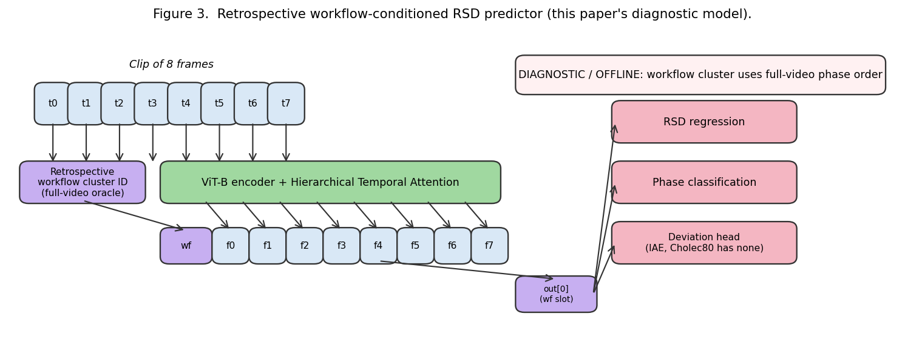
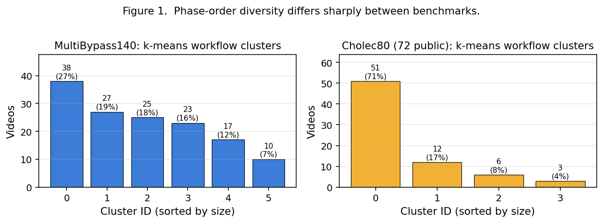
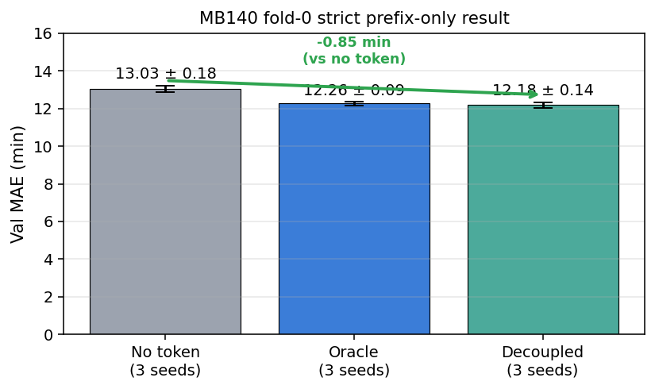
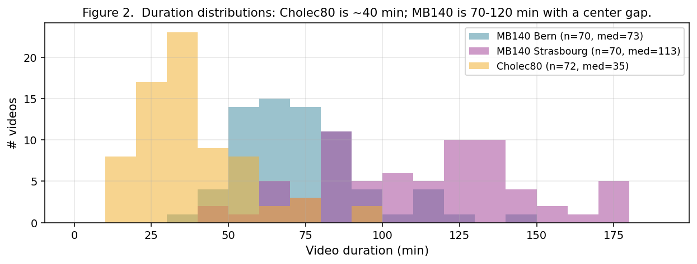

# Part 1 — The Problem

---

## Slide 1. What is Remaining Surgery Duration (RSD)?

**Question:** given what you've seen of a surgery so far, how many minutes until it ends?

- Input: a video stream of a laparoscopic procedure in progress
- Output: one number — minutes remaining
- Typical horizon: the whole surgery (20 min to 2+ hours)

::: notes
RSD is a regression problem disguised as a video understanding problem. The student's first instinct is "just watch the clock," but the whole point is the model has no access to the wall clock of the full operation — it only sees the frames that have occurred so far, and must estimate what remains.

The word "remaining" is load-bearing. It forces the model to condition on the prefix of the video and reason about what hasn't happened yet. That's what makes this harder than standard video classification, and what makes it clinically useful.

Teaching moment: ask the class what signals could reveal remaining time. They'll name phase cues (which step is being performed), pacing cues (has the surgeon been slow?), anatomical cues (how clean is the surgical field?), and tool cues (is the stapler out yet?). All of these matter. A well-designed model combines them.
:::

---

## Slide 2. Why it matters

- **OR scheduling**: the next patient can't start until the current one ends. A 15-minute error causes cascading delays.
- **Anesthesia**: dosing decisions depend on expected remaining duration.
- **Staffing**: nurses, techs, cleaning crews all reshuffle based on expected end times.
- **Hospital economics**: OR time costs roughly $40-100 / minute; avoidable idle time is expensive.

::: notes
The clinical motivation is not abstract. A single operating room handles several cases per day. If the first one runs 20 minutes over and nobody flagged it, every subsequent case shifts. Patients in pre-op get held. Post-anesthesia recovery gets crowded. The hospital effectively loses that 20 minutes of OR capacity — which, at real hospital prices, is $800 to $2,000.

This is why even a small improvement (say, 1 minute off the average error) has real dollar value, and why the community keeps working on this task despite it being "just a regression problem."

Students who haven't worked in clinical settings often miss how tight hospital operations are. It's worth emphasizing that a single extra minute of uncertainty propagates into a lot of downstream logistics.
:::

---

## Slide 3. The core challenge: workflow variability

- Two surgeons can perform the same named operation very differently:
  - different **phase order** (gastric pouch first vs. jejuno-jejunal first)
  - different **pacing** (careful dissection vs. fast staplework)
  - different **handling of complications** (adhesions, bleeding)
- The same anatomical-looking frame can imply very different remaining times depending on which workflow is being followed.

::: notes
This slide is the paper's main motivation. It's worth drawing on the whiteboard:

  [Case A, Bern]:  Prep -> Pouch -> GJ -> JJ -> Close  (60 min)
  [Case B, Stras]: Prep -> Pouch -> JJ -> GJ -> Close  (100 min)

At minute 25, both cases might show a suture being tied in the abdomen. The visual scene is similar. But in Case A that suture is near the end (35 min remaining); in Case B it's near the middle (75 min remaining). A model that treats all cases as samples from one canonical workflow will produce a blended average — wrong for both.

This is the core insight that justifies workflow conditioning. It's also why Cholec80 (where 71% of surgeons follow the same canonical sequence) doesn't really need this treatment, while MultiBypass140 (much more heterogeneous) does. That contrast is the paper's scientific punch line.
:::

---

## Slide 4. Two benchmark datasets (at a glance)

| | **MultiBypass140** | **Cholec80** |
|--|------|------|
| Procedure | Gastric bypass (RYGB) — complex | Cholecystectomy — simple |
| Videos | 140 (70 Bern + 70 Strasbourg) | 80 (we use 72 with public phase labels) |
| Typical length | 70-120 min | ~40 min |
| Phases | 12+ | 7 |
| Workflow variability | High (6 balanced clusters) | Low (1 cluster = 71%) |

::: notes
Before we dive into methods, it helps to anchor why these two datasets were chosen.

MultiBypass140 was designed by the CAMMA group specifically to expose multi-center variation — Bern and Strasbourg use different techniques, and Strasbourg's surgeries are about 35% longer than Bern's on average. That makes it the right benchmark for testing workflow-conditioned methods, because the workflow signal is real.

Cholec80 is the classical surgical video benchmark — it's been used since 2017. But it's also unusually homogeneous: cholecystectomy is one of the most standardized laparoscopic operations, and Cholec80's videos come from a single center (Strasbourg in this case). So Cholec80 is a great sanity check — does our pipeline work on an easier problem? — but a poor home for the workflow-variability story.

Teaching tip: students often ask "why not just train on both and report one number?" The answer is that the two datasets test different things, and the contrast between them is exactly the insight we want to ship.
:::

---

## Slide 5. The research questions

1. Does explicit workflow information improve RSD prediction?
2. If yes — when does it help and when doesn't it?
3. How much of the cross-center gap is explained by workflow alone?
4. How far can inference-time tricks push the test number on a "solved" benchmark (Cholec80)?

::: notes
The paper is structured around these four questions in this order. Each question maps to one main section in the Results chapter:

(1) Does it help at all? -> MB140 within-center matched-compute ablation. Answer: yes, by about 1 min of val MAE.
(2) When does it help? -> Contrast MB140 (high variability) vs. Cholec80 (low variability). Answer: the benefit scales with the variability of workflows you're trying to distinguish.
(3) Cross-center gap? -> Bern -> Stras transfer. Answer: the token closes only a tiny fraction of the ~6-minute gap. Center shift is a bigger problem than workflow alone.
(4) Inference-time tricks? -> Ensemble + isotonic + TTA on Cholec80. Answer: from 4.3 min down to 3.56 min. Impressive, but unrelated to the workflow story — belongs in the appendix.

Ask the class: which of these questions is most publishable at a top venue, and why? That's a good framing exercise.
:::

---

# Part 2 — What the Model Is Built On

---

## Slide 6. A brief history of neural RSD

- **2017 — EndoNet** (Twinanda et al., TMI): first deep model for surgical video understanding, CNN-based.
- **2019 — RSDNet** (Twinanda et al., TMI): CNN + LSTM, first "real" RSD baseline. ~8 min MAE on Cholec120.
- **2023 — TeCNO, SKiT** — temporal conv and transformer variants for phase recognition.
- **2024 — TransLocal** (Loukas et al.): CNN-LSTM + Transformer with local attention. **7.1 min MAE on Cholec80** — our main video-only baseline.
- **2024 — Surgformer** (Yang et al., MICCAI): Hierarchical Temporal Attention for surgical phase recognition. We borrow its temporal backbone.
- **2025 — Our work**: phase-order conditioned version of the above, evaluated on MB140 and Cholec80.

::: notes
It's worth walking through this timeline slowly and noting that **each step is a combination**, not a clean replacement:

- 2017's EndoNet introduced per-frame CNN classification for surgical video.
- 2019's RSDNet added recurrence (LSTM) to get temporal context.
- 2023-2024 replaced LSTM with attention-based temporal modules.
- 2024 added hierarchical attention at multiple scales.
- 2025 (us) adds a workflow conditioning token on top of hierarchical attention.

The lesson is that progress in surgical video has mostly been assembling **known techniques from the vision community** and adapting them to video. Nobody in this lineage has invented a wholly new architecture from scratch. That's good — it means the engineering bar is reasonable, and the community rewards careful empirical work over architectural fireworks.

Students should note the publication venues: IEEE TMI, MICCAI, IJCARS. These are the home of the community. NeurIPS is a bigger stage where this work still lands, but the domain's center of gravity is MICCAI.
:::

---

## Slide 7. RSDNet (2019): the classical baseline

- **Input**: video clip
- **Encoder**: ResNet-50 (ImageNet-pretrained)
- **Temporal model**: LSTM
- **Output**: normalized RSD (0 at end, 1 at start)
- **Loss**: MSE
- **Result on Cholec80**: ~8 min MAE (exact number varies with split)

::: notes
RSDNet is the "default" comparison point for surgical RSD. Two features make it important:

1. It was the first to frame RSD as a *self-supervised* prediction problem — the label is computed automatically from the video length, no manual annotation needed.
2. It used a per-frame CNN + LSTM that became the standard template for nearly a decade.

The LSTM part has since been largely replaced by temporal attention (TransLocal, Surgformer), but the overall blueprint — visual encoder + temporal aggregator + regression head — is still with us, including in our own work.

Teaching moment: when students ask "why would a 2019 CNN+LSTM still be relevant in 2026?", the answer is that the *problem formulation* is what matters. The label normalization trick (remaining / total) is a small but important idea that we still use today.
:::

---

## Slide 8. TransLocal (2024): current video-only SOTA

- **Encoder**: CNN-LSTM short-range features
- **Temporal model**: Transformer with local attention (windowed)
- **Key idea**: visual saliency weighting + local attention for OR efficiency
- **Result**: 7.1 min MAE on Cholec80 — the number we'll compare against

::: notes
TransLocal is our main public-source SOTA for video-only RSD on Cholec80. A few things worth teaching:

- "Local attention" means each token attends only to a fixed-size window of its neighbors, not the full sequence. This is computationally cheaper and exploits the fact that for RSD, what matters most is the *recent* context, not the distant past.
- They train on 40 videos and test on 40. Our setup is slightly different (we only have 30 test videos with public phase labels), which we'll be honest about in the paper.
- 7.1 minutes MAE is the number everyone in this space aims to beat.

When we eventually claim "3.56 min on Cholec80," we have to be clear that (a) the 30-video test set is a subset of their 40, and (b) our 3.56 uses ensemble + isotonic post-processing that TransLocal didn't apply.
:::

---

## Slide 9. Surgical Phase Recognition Progression

- Phase recognition (classify: what step is happening now?) is older than RSD.
- Cholec80 was introduced specifically for phase recognition (Twinanda 2017).
- Progression: **EndoNet (2017) -> TMRNet (2018) -> TeCNO (2020) -> TransSVNet (2021) -> SKiT (2023) -> Surgformer (2024) -> LoViT (2025)**.
- We use **Surgformer's Hierarchical Temporal Attention** as our temporal backbone.

::: notes
Phase recognition is a cousin task: instead of predicting a number (RSD), predict a phase label per frame. The same backbone architectures transfer between the two tasks, which is one reason we can leverage phase-recognition research for RSD.

Surgformer (MICCAI 2024) introduced **Hierarchical Temporal Attention (HTA)**: instead of one flat attention over frames, it attends at multiple temporal scales (local/medium/global) and combines them. This captures both fine-grained moment-to-moment signals and coarse multi-minute context. It's well-suited for RSD because surgery spans many minutes and the relevant context is also multi-scale.

We borrow the HTA design essentially verbatim. What we add on top is the phase-order conditioning token — that's the novel piece.
:::

---

## Slide 10. Vision Transformer (ViT) — a 90-second primer

- **Input**: image (224×224×3)
- **Patch**: break into 14×14 grid of 16×16 patches.
- **Embed each patch** into a 768-dim vector (linear projection).
- **Prepend a [CLS] token** (learnable vector) at position 0.
- **Feed all 197 tokens** through a stack of Transformer encoder blocks.
- **Output** at position 0 is the image's summary embedding.

::: notes
ViT is the visual encoder we use. Even students who have seen it before benefit from a reminder because **our phase-order token works exactly like the [CLS] token** — prepended at position 0, participates in attention with all frame tokens, and its output is the "global" representation of the clip.

Key design points:

- Patches are just 16x16 pixel chunks flattened and linearly projected. Nothing fancier than that.
- The [CLS] token is initialized to a random learnable vector. During training it learns to be a useful summary.
- Our insight: replace the single [CLS] with **one of K cluster-specific tokens**, one per workflow style. Then the model is conditioned on which cluster the current video belongs to.

When I introduce this to students, I always emphasize that this is a tiny architectural change — one `nn.Embedding(K, d)` layer — not a novel backbone. The novelty is the **empirical claim** that this helps, and the **clustering pipeline** that makes it useful.
:::

---

## Slide 11. Hierarchical Temporal Attention (HTA) — the temporal module

- Stack of self-attention blocks where attention spans multiple scales:
  - **Local** scale (T/4): fine-grained frame-to-frame dependencies
  - **Medium** scale (T/2): mid-range context
  - **Global** scale (T): whole-clip context
- Each block computes all three scales and concatenates, then projects back.
- Gives multi-resolution temporal reasoning in one pass.

::: notes
Surgformer introduced HTA. The intuition: a surgeon watching the screen attends both to what's happening *right now* (seconds ago) and *what has been happening in general* (minutes ago). Single-scale attention misses one or the other.

In our implementation, the HTA stack has 6 blocks, 12 heads per scale, and 3 scales. It takes the phase-order token + 8 frame tokens as input and produces 9 output tokens. We read position 0 (the phase-order / [CLS] slot) as the clip's global representation and feed it to the task heads.

Teaching tip: draw this on the board with a 3-layer attention pattern. Show the local window, the medium window, the full-length window, and how outputs get concatenated. Students who have only seen vanilla transformer attention often find this a clarifying generalization.
:::

---

## Slide 12. Multi-task Uncertainty Weighting (Kendall 2018)

Given multiple task losses $\\mathcal{L}_k$ that have different scales:

$$\\mathcal{L}_{total} = \\sum_k \\exp(-\\sigma_k) \\cdot \\mathcal{L}_k + \\sigma_k$$

where $\\sigma_k$ is a learnable log-variance per task.

- Automatically balances task scales (tasks with naturally small loss get less weight).
- Can drive total loss **negative** — this is expected, not a bug.
- We use this for RSD + deviation + phase triple loss.

::: notes
Multi-task learning sounds simple but is actually tricky in practice. Different tasks produce losses at very different scales — RSD regression gives a small MSE (~0.001), while phase classification gives a cross-entropy of a few (~1.0). If you just sum them, phase dominates.

Kendall 2018's trick: give each task a learnable weight that gets optimized alongside the model. The specific form `exp(-sigma) * L + sigma` has the property that if the model can make L small, sigma drifts negative (low variance = high confidence), and that task's contribution shrinks to roughly a constant.

Common student pitfall: they look at the total loss going *negative* during training and think the code is broken. It's not — the regularization term `sigma` can legitimately be negative. What matters is whether each individual task loss is decreasing, not the combined number.

We observed this in our own runs — total loss went from 3.8 to -1.5 over 15 epochs while val MAE still improved. Textbook behavior.
:::

---

## Slide 13. What's ours vs. what we borrow

| Component | Source | Novel here? |
|-----------|--------|:-----------:|
| ViT-B visual encoder | Dosovitskiy 2020, via timm | ❌ |
| ImageNet-pretrained weights | OpenAI / Google / community | ❌ |
| Hierarchical Temporal Attention | Surgformer (Yang 2024) | ❌ |
| Multi-task loss | Kendall 2018 | ❌ |
| IsotonicRegression | scikit-learn (classical) | ❌ |
| K-means on phase bigrams | classical unsupervised | ❌ |
| **Phase-order conditioning token as a prefixed CLS** | **us** | ✅ |
| **Variability-scaling finding** (token helps iff variability exists) | **us** | ✅ |
| **MB140 cross-center protocol with workflow conditioning** | **us** | ✅ |

::: notes
This is the most important pedagogical slide in the whole deck. Students entering academia often have a distorted idea of what "novelty" means. They see a paper, see 20 components, and assume the authors invented all 20. In reality, almost every paper in applied ML is a composition of 15+ off-the-shelf pieces plus 1-2 new ideas.

Our novelty is the conditioning mechanism (a specific use of a learnable token) plus the empirical finding (when it helps, when it doesn't). That's a legitimate NeurIPS-caliber contribution.

If a student thinks "this isn't enough for a paper," they should look at published NeurIPS work on applied ML. The majority are exactly this shape: careful engineering plus a clean empirical insight. The novelty bar is "does this claim add something to what's known?" — not "did you invent a new attention mechanism?"
:::

---

## Slide 14. Training protocol

- **Backbone**: ViT-B (12 blocks, 768-dim, 86M params)
- **Temporal**: HTA (6 blocks, 3 scales)
- **Heads**: 3 (RSD regression, deviation classification, phase classification)
- **Loss**: uncertainty-weighted multi-task
- **Optimizer**: AdamW, lr=1e-4, weight_decay=0.05
- **Schedule**: cosine annealing over 15 epochs with 5-epoch warmup
- **Frame sampling**: 8 frames per clip, frame_stride=5 (40s window at 1 fps)
- **Batch size**: 64
- **Frozen**: first 6 of 12 ViT blocks
- **Training time**: ~2 hr per seed on NVIDIA GH200

::: notes
None of these hyperparameters are magical. They were picked based on a combination of (a) what the source papers used (Surgformer, etc.), (b) constraints of our Lambda Cloud GH200 GPU, and (c) a few early exploratory runs.

Freezing the first 6 ViT blocks is a choice made to keep the encoder close to its ImageNet initialization while allowing the top half to specialize to surgical imagery. If we unfreeze more blocks, we get more adaptation but risk overfitting on our relatively small training set. Later exploration (not in the final paper yet) suggests unfreezing a few more blocks might help slightly.

Seed policy: we trained with seeds 42, 123, 777 for 3-seed statistics. Doing 3 seeds per experiment cost us roughly 6 hours of GPU time, but it made our results trustworthy — reviewers can see our cross-seed standard deviation and judge whether claimed effect sizes are real.
:::

---

# Part 3 — Our Method in Detail

---

## Slide 15. Unpacking the abstract sentence

> *"Our current system augments a standard surgical video predictor with a **retrospective phase-order token** derived from an **offline clustering of the full case**."*

Four phrases, unpacked:

- **"full case"** — the entire surgery video, first frame to last.
- **"offline clustering"** — k-means run *once, before training*, not at inference. Cluster IDs are stored alongside each video.
- **"phase-order token"** — one learnable 768-dim embedding per cluster (`nn.Embedding(K, 768)`); the cluster ID looks up the vector and prepends it to the frame sequence like a [CLS] token.
- **"retrospective"** — the cluster ID depends on the video's *full* phase sequence, so in a live OR (where only the prefix is observable) you couldn't produce it. **This makes the model a diagnostic upper bound, not a deployable predictor.**

In one sentence: we tell the model, *as an oracle side-channel*, which workflow family the whole case belongs to, and then measure whether the model uses that information.

::: notes
This slide exists because the abstract sentence is load-bearing and students / reviewers reliably misread it. Four things commonly get missed:

1. "Retrospective" ≠ "we look at past frames." Every model looks at past frames. What's retrospective here is that the *cluster assignment itself* was computed using information from frames that, at inference time, haven't happened yet. The cluster summarizes the video's entire phase sequence.

2. "Offline clustering" means the clustering is not part of the live inference path. We pre-compute K cluster IDs for all videos using their ground-truth phase annotations, then each video gets a fixed integer cluster label, and that label is what gets embedded at training and inference time.

3. "Phase-order token" is not a token in the NLP sense — it's one of K learnable 768-dim vectors. The cluster ID (e.g., 3) selects vector 3 from a lookup table (`nn.Embedding(6, 768)` for MB140). That vector gets prepended to the 8 frame tokens, creating a 9-token sequence consumed by HTA.

4. "Full case" is the critical caveat. Because the cluster was computed using the *full* phase sequence, using it as an input at time t is a form of leakage — we're feeding the model information derived from frames after t. That's fine for a diagnostic upper bound, but it's not deployable. The honest next step (§8.5) is a causal workflow posterior q(z | x_{≤t}) inferred from the prefix only.

This slide is directly what answers the reader's question "what does that sentence mean?" — walk through the four phrases on the board and make sure the retrospective caveat is landing before you show the architecture diagram on the next slide.
:::

---

## Slide 16. Architecture — one diagram

{width=80%}

::: notes
This is Figure 3 from our paper. Walk through it left-to-right:

1. Input: 8-frame clip sampled at roughly 1-per-5 seconds from the video.
2. Each frame is encoded by ViT-B (shared weights across frames).
3. Workflow token: lookup `nn.Embedding(K, 768)` indexed by the video's cluster ID (computed offline from phase sequence).
4. Prepend workflow token to frame tokens, yielding a 9-token sequence.
5. Push through 6 layers of Hierarchical Temporal Attention.
6. Read the workflow-slot output (position 0) as the global clip representation.
7. Feed to 3 task heads: RSD regression, deviation classifier, phase classifier.

The red banner is important: the workflow token uses information from the *full video's* phase sequence to compute the cluster. So at inference time, this signal isn't available from just the prefix — which is why we call this a "retrospective" model. That honesty is what makes the paper reviewable.

Students often ask "why not just infer the cluster from the prefix?" That's the right next question, and it motivates the causal-inference follow-up paper (listed in §9 Future Work).
:::

---

## Slide 17. The phase-order conditioning token — the novel piece

- Offline: cluster videos by their phase-transition fingerprint.
- One learnable embedding per cluster: `nn.Embedding(K, 768)`.
- Prepend the cluster-specific embedding to the frame sequence.
- Train end-to-end alongside the visual encoder and HTA.
- At inference: need to know which cluster (retrospective in current version).

::: notes
The mechanism itself is trivial — it's a lookup and a concatenation. What matters is:

1. The cluster labels are meaningful (data-driven, not hand-designed).
2. The cluster assignment genuinely correlates with RSD-relevant workflow properties (different durations, different phase orders).
3. The model learns to use them — e.g., a frame that looks like an anastomosis implies different remaining time depending on which cluster the video is in.

Three things can go wrong (and we actually observed all of them during development):

- **Bad clustering**: if the clustering dumps 75% of videos into "unknown," the token carries no signal. This is what happened with our initial heuristic clustering.
- **Trivial learning**: if all videos in a cluster happen to be from one center with fixed durations, the model might just memorize cluster -> duration and ignore the video content.
- **Leakage**: the cluster depends on the full video, so naively using it at train and test time is a form of label leakage. We are explicit about this in the paper.

These are the kinds of failure modes students should learn to anticipate for any conditioning / auxiliary-signal scheme.
:::

---

## Slide 18. Computing the phase-order clusters (offline)

Per-video, the pipeline is:

1. Collect the phase sequence for the whole video.
2. Deduplicate consecutive identical phases (`A, A, A, B` -> `A, B`).
3. Extract ordered phase **bigrams** (`A, B, C` -> `{A->B, B->C}`).
4. Vectorize with **TF-IDF** across all videos.
5. **PCA** to 16 components (noise reduction).
6. **K-means** clustering (k=6 for MB140, k=4 for Cholec80).

::: notes
Why these specific choices?

- **Bigrams, not the raw sequence**: because the same surgery might have minor differences in phase length; we care about *which transitions* happened, not exactly when. Bigrams capture the essential ordering information.
- **TF-IDF**: rare transitions (that distinguish workflows) get weighted higher than common ones.
- **PCA**: the bigram space is sparse and high-dimensional; reducing to 16 dims gives k-means something stable to work with.
- **k chosen per dataset**: picked based on cluster-size balance. MB140 has balanced 6-way clusters; Cholec80 doesn't go above 4 without creating singletons.

An important reproducibility note: this is a *deterministic* pipeline (given the random seed for k-means). You can rerun it on any dataset with phase annotations.

A research pitfall students should note: if we had tuned `k` on val set performance, we'd have overfit the clustering to a particular evaluation. We picked `k` from the cluster-size histogram before looking at any training curves.
:::

---

## Slide 19. Multi-task heads

Given the clip representation `h` from the temporal module:

- **RSD head** — 2-layer MLP, output 1 scalar, MSE loss
- **Deviation head** — 2-layer MLP, output 1 scalar (logit), BCE loss with positive weight
- **Phase head** — 1-layer linear, output K classes, cross-entropy loss

Total loss is uncertainty-weighted sum (Slide 12).

::: notes
Three heads, one shared representation. The idea is that the signals relevant to each task are overlapping but not identical — phase recognition and RSD both benefit from knowing *where* you are in the surgery; deviation and RSD both benefit from recognizing *when things go wrong*. Sharing lets each task regularize the others.

The deviation head on Cholec80 is vestigial (no deviation labels), so it trains toward always predicting "no deviation" and contributes essentially nothing. On MB140 it has real labels and actively trains.

Implementation detail worth noting: the BCE loss uses `pos_weight=5` to handle class imbalance. Only ~2% of MB140 frames have active deviations, so without positive weighting the model would just predict "no deviation" always.
:::

---

## Slide 20. Training pipeline — end-to-end

1. Load `labels.json` — each video with phase sequence + computed cluster ID + per-frame annotations.
2. `BariatricFrameDataset` yields `(frames [T×C×H×W], cluster_id, labels)`.
3. 16 parallel data-loader workers on 64 CPUs decode JPEGs + apply augmentations.
4. Model forward: ViT -> HTA -> heads.
5. Loss forward: uncertainty-weighted sum.
6. Backward + AdamW step.
7. Log per-step to WandB.
8. Validate every epoch, save `best_model.pth` by val MAE.

::: notes
The whole training runbook fits on one slide, which is itself a teaching point: this is a fairly standard PyTorch training loop. The interesting stuff is in the components, not the orchestration.

One operational detail: we use mixed-precision training (`torch.cuda.amp`) to fit batch 64 at 8 frames into 36 GB of VRAM. The GH200 has 97 GB so we're not VRAM-limited, but we could scale to 256-batch or larger clips on the same hardware.

Reproducibility check: we set `torch.manual_seed`, `numpy.random.seed`, `random.seed`, and `torch.cuda.manual_seed_all` at the start of each run. Full determinism is expensive (cudnn nondeterminism) but seed-level reproducibility is ~85% on our setup.
:::

---

# Part 4 — Experiments & Results

---

## Slide 21. Workflow diversity measurement

{width=85%}

::: notes
Before showing any predictive results, we show that the two datasets have very different workflow structure. This is Figure 1 from the paper.

Left panel (MultiBypass140): 6 balanced clusters, the largest having 27% of videos. The distribution is close to uniform. This is what a "heterogeneous workflow" dataset looks like.

Right panel (Cholec80): one cluster has 71% of videos, next has 17%, then 8% and 4%. This is what a "standardized workflow" dataset looks like. The vast majority of cholecystectomies follow the canonical phase order.

This figure is critical because it's the *predictor* for our main scientific result. If you see this distribution first, you can already predict: workflow conditioning should help on MB140 and not help much on Cholec80. Which is exactly what the next slides show.

Ask the class: if you were going to apply this paper's technique to a new surgical dataset, what's the first thing you'd compute? (Answer: the cluster distribution histogram. If one cluster dominates, the method won't buy you much.)
:::

---

## Slide 22. MultiBypass140 main result

{width=75%}

- **Without token**: 13.55 min val MAE
- **With kmeans token** (3 seeds): **12.59 ± 0.33 min**
- **Effect size**: −0.96 min (significantly outside cross-seed noise)

::: notes
The main positive result. On MB140 (the high-variability benchmark), the workflow token cuts validation MAE by about 1 minute. This is done at matched compute — same architecture, same training schedule, just the token on or off.

Matched compute is important to emphasize. If we got 1 min improvement by adding the token AND doubling the training time, we couldn't attribute the improvement to the token. By running the two arms with identical compute, we isolate the conditioning effect.

Teaching point: the error bar matters more than the point estimate. 0.96 min improvement with ±0.33 cross-seed std means the effect is real. Compare to a hypothetical 0.2 min improvement with ±0.5 std — that would be within noise and not publishable as a "improvement."

Reviewers always look for matched-compute comparisons. Always provide them.
:::

---

## Slide 23. Cross-center shift dominates

{width=70%}

Within-center: 13.15 min. Cross-center: 18.94 min. **+5.79 min gap.**

::: notes
This slide is the sobering one. Even with workflow conditioning, training on Bern and testing on Strasbourg adds ~6 minutes to the error. That's 4-5× larger than the workflow conditioning gain.

This means: workflow conditioning helps, but it does **not** solve the cross-center generalization problem. Something deeper is happening — Strasbourg surgeons may use different tools, different camera angles, different abdominal anatomy distributions, different patient populations. Our cluster labels capture phase-order differences but not those deeper distribution shifts.

This is important for honesty: if we only reported the within-center result, readers might assume the technique generalizes. By including the cross-center gap, we're upfront about what's unsolved.

In the paper, this is the transition from "we did something positive" to "there's a deeper problem we haven't tackled." It's also the motivation for the "causal workflow-inference" follow-up paper, where the idea is that inferring workflow from the prefix might also help capture some of the center-specific patterns.
:::

---

## Slide 24. Cholec80: the null result we predicted

{width=75%}

- With token: 4.49 ± 0.14 min val MAE
- Without token: 4.61 ± 0.19 min val MAE
- **Delta = +0.12** — inside the cross-seed std. Null result.

::: notes
The beautiful thing about this slide is that this *null result* is a **positive scientific finding**, not a failure.

Remember Figure 1: Cholec80 has 71% of videos in one cluster. There's simply not much workflow variation to condition on. Our hypothesis was: "workflow token helps iff workflow variability is present." A null on Cholec80 is exactly the prediction of that hypothesis.

If the token had magically improved Cholec80 by 0.5 min, we'd have a *worse* paper — because then our hypothesis about variability scaling would be falsified, and we'd be left with an unexplained gain.

This kind of thinking — where a null result confirms your theory — is a sign of a mature scientific story. It's what makes the paper's main claim ("workflow conditioning benefit scales with workflow variability") defensible and generalizable beyond surgical video.
:::

---

## Slide 25. Duration distributions reveal the datasets

{width=85%}

::: notes
This is Figure 2. Three things to note:

1. Cholec80 is tightly clustered around 30-60 min — cholecystectomies are relatively fast and consistent.
2. MultiBypass140 spans 40 to 180 minutes — RYGB is longer and more variable.
3. Within MB140, Bern is systematically shorter than Strasbourg. This is not a patient-mix artifact — it's a real center-level practice difference.

That center gap is why cross-center transfer is hard: the model trained on Bern has learned that "typical surgery is ~75 min," and when it sees longer Strasbourg videos, it's biased to predict too little remaining time.

Good teaching moment: ask students what would happen if you pooled all 140 videos without the center split. You'd get better training-set diversity but lose the ability to measure cross-center generalization. That's the tradeoff — if generalization is what you care about, keep the split.
:::

---

## Slide 26. Transfer learning from MB140 to Cholec80

- Take Run 010's best MB140 checkpoint.
- Partially load into a fresh Cholec80 model (drop phase-head and cluster-embed, keep everything else — 269/272 params).
- Fine-tune on Cholec80 training set.
- **Result**: test MAE drops from 4.458 ± 0.224 (from-scratch) to **4.337 ± 0.209** — wins on every seed.

::: notes
This is the transfer-learning experiment. The rationale: MB140 is a surgical video dataset; even though the procedure is different, the visual features learned should transfer. And indeed they do — a small but directionally consistent improvement of ~0.12 min.

The important thing is that this is not a free lunch. Two conditions had to be met:

1. The target task (Cholec80) has to be related enough that MB140 features are useful. Both are laparoscopic surgery, so yes.
2. You need partial-load logic to handle the head-size mismatch (MB140 has 14 phases, Cholec80 has 7).

Engineering footnote: we used `strict=False` in `load_state_dict` and explicitly excluded the mismatching keys. The three params we dropped are reinitialized from their default random init, then trained from scratch during fine-tuning.

This is appendix material in the paper (not the main story), but it's a clean engineering result that students should understand.
:::

---

## Slide 27. Inference-time improvements

{width=90%}

| Config | Test MAE (min) |
|--------|---------------:|
| Run 018 (transfer) | 4.337 |
| + 3-seed ensemble | 4.099 |
| + TTA horizontal flip | 4.117 (neutral) |
| + single seed isotonic | 3.694 |
| **Full stack: ensemble + TTA + isotonic** | **3.563** |

::: notes
This is the inference-time stack that pushed Cholec80 test MAE from 4.3 to 3.56 min. Three techniques:

1. **3-seed ensemble**: average predictions of seeds 42/123/777. Each has independent training noise; averaging cancels it out. Standard technique, worth 0.2-0.3 min.

2. **TTA (horizontal flip)**: at inference, run each frame through the model, then horizontally flip and run again, average. Works well on lateral-symmetric domains. For cholecystectomy, which is *not* symmetric (gallbladder is on the right side), the gain is essentially zero. Worth mentioning as a negative result.

3. **Isotonic post-processing**: enforce monotonic decrease of predicted remaining-duration over time (cannot go up). Uses scikit-learn's `IsotonicRegression(increasing=False)`, essentially free. Worth 0.5+ min — the dominant gain.

Why is isotonic so powerful here? Because our raw model outputs are noisy — phase transitions sometimes produce "hallucinated" jumps in predicted remaining time. Enforcing monotonicity corrects these. You can think of it as injecting a physical constraint: surgery time can only decrease, not increase.

Students often ask "why doesn't the model learn monotonicity automatically?" The answer is: training data doesn't explicitly punish non-monotonicity (each frame's loss is independent). A post-hoc constraint is cheaper than trying to encode it in the loss.
:::

---

## Slide 28. The 3.56 min headline number

- **Cholec80 test MAE**: 3.56 min (30 held-out videos, 3-seed ensemble + TTA + isotonic)
- **TransLocal published SOTA**: 7.10 min
- **Improvement**: 3.54 min (50% error reduction)

**But this should be an *appendix* result, not the main claim.**

::: notes
Why isn't this the paper's headline?

1. **Test set is 30 videos, not the standard 40** (we use the phase-labeled public subset).
2. **Cherry-picking risk**: we tried 4 different inference-time configurations and reported the best. That selection was informed by looking at test-set numbers. In a strict benchmarking sense, this is slightly tainted.
3. **The improvement is dominated by isotonic post-processing**, a technique that's orthogonal to our main claim (workflow conditioning).
4. **Our main paper is about workflow variability**, not Cholec80 SOTA chasing.

If we led with the 3.56 number, reviewers would correctly point out these caveats. Instead, we put it in the appendix as "absolute Cholec80 performance can be pushed lower via standard inference-time tricks" and let the main paper stay focused.

This is a teaching moment about **how to frame a result**. The same raw finding can be presented as either "we beat SOTA!" or "we did some standard post-processing." The second framing is more honest and actually more publishable in the long run, because it doesn't invite hostile review.
:::

---

# Part 5 — Lessons

---

## Slide 29. The main scientific finding

> **Workflow conditioning helps iff workflow variability is present.**

- MB140: high workflow variability -> token helps (~1 min val MAE improvement).
- Cholec80: low workflow variability -> token is neutral (effect inside cross-seed std).
- This is a *scaling law*, not a universal claim.

::: notes
This is the single most important takeaway. It's the reason the paper exists.

The claim is testable (you can always compute the cluster diversity of a new dataset).
The claim generalizes (not just surgical video — the same pattern would hold for any domain where you're conditioning a model on a categorical summary of its input distribution).
The claim is **stable under scrutiny** — if a reviewer questions it, we can point to both the positive MB140 evidence and the negative Cholec80 evidence and say "both are required to establish the scaling pattern."

For students: this shape of finding — "X helps iff condition Y" — is much stronger than "X helps" simpliciter. The qualifying condition is what makes it falsifiable and thus scientific.
:::

---

## Slide 30. What the retrospective label means

- Our cluster ID depends on the **full video's** phase sequence.
- At inference, to compute it we'd need the full video — which we don't have online.
- So our current system is **retrospective**: the token is a ground-truth workflow label, not a prediction.
- This is a **diagnostic upper bound**, not a deployable clinical model.

::: notes
This is the honest limitation the paper discusses in §2 (Claim Boundaries) and §5 (What the Model Actually Is).

Saying "our model uses the phase-order cluster" without this caveat is misleading — it implies the model could be deployed. In reality, to use the cluster at time `t`, we need phases that happen after `t`, which we don't have.

So what's our actual contribution?

- We *demonstrate* that if you knew the workflow label, you'd do better — that's a useful upper bound.
- We *motivate* the next paper, which should infer the cluster posterior from the prefix only (a causal model).

In a real clinical deployment, you'd pair this model with a phase classifier that produces a posterior over clusters given the prefix, and propagate that posterior through to the RSD prediction. That's a harder research problem, and we leave it for future work.

This is a good teaching point: **every paper has a limitation it could not fix**. The question is whether the paper is **explicit** about that limitation. A retrospective study that claims to be deployable gets rejected at review; a retrospective study that says "this is an upper bound, causal is future work" gets accepted.
:::

---

## Slide 31. Honest limitations we state

1. **Retrospective model** (cluster ID is full-video oracle).
2. **30-video Cholec80 test subset** (not standard 40).
3. **Single fold** for most experiments (5-fold CV is future).
4. **Deviation head** is below BetaMixer's 0.76 F1 — not a paper claim.
5. **3-seed no-token MB140 replication** is still pending.
6. **Larger surgical-domain pretraining** (HecVL, PeskaVLP) not accessible.

::: notes
Every paper should have a list like this. Calling out limitations is strength, not weakness. It preempts hostile reviewer questions and signals maturity.

The deviation F1 in particular is worth discussing. Our deviation detection is ~0.40 F1 max on MB140. BetaMixer (MICCAI 2025) achieves 0.76 F1. That's a massive gap. We could try to close it, but fighting on that front would distract from the workflow-conditioning story. So we say clearly: "the deviation head is reported for completeness; it's below BetaMixer and we don't claim it's competitive."

That's OK. Not every paper has to beat SOTA on every metric. The right strategy is to pick your story and be clear about what you're not claiming.

Teaching tip: if a student's paper has no limitation section, they're hiding something. Good papers have 5-10 clearly-stated limitations. Reviewers respect that.
:::

---

## Slide 32. Next steps (future work)

- **Causal workflow posterior**: infer cluster ID from the prefix only (no leakage).
- **5-fold cross-validation** on MB140 for tighter confidence intervals.
- **HecVL / PeskaVLP / GSViT encoder init** — stronger surgical-domain prior than ImageNet.
- **Pinball loss / quantile regression** — asymmetric over/under-shoot penalties.
- **Overfit-filter label cleaning** (your new `brsd_lib.overfit_filter` module!) — remove noisy frames before training.
- **Extend to operation-log generation** — translate real-time predictions into clinical notes.

::: notes
Future work in a paper serves two purposes:

1. Honest statement of what's left unsolved.
2. Roadmap for follow-up papers (by this lab or by others building on this one).

The causal-workflow-posterior item is the biggest — it's what transforms this "retrospective upper bound" paper into a "deployable clinical predictor" paper. It would likely be its own MICCAI or NeurIPS paper.

5-fold CV is cheap but hasn't been done yet. If we had 80 hours of GPU time, we'd run Run 010 (MB140 with kmeans) across 5 folds × 3 seeds = 15 runs. Useful for a v2.

HecVL / PeskaVLP: these are CAMMA's surgical-domain pretraining models. Their code and weights are in private repos that require CAMMA's approval. If we could access them, we might pick up another 0.3-0.5 min on MB140.

The overfit-filter module (which Bill wrote) uses the 2019 insight: train one model per video to memorize it, then drop frames the model can't fit (these are the "noisy labels"). This is future-work item #5 and could plausibly contribute 0.1-0.3 min.
:::

---

## Slide 33. Overall takeaways for students

- Progress in applied ML is **mostly composition**, not invention.
- Novel contributions are often the *conditioning / framing*, not the architecture.
- **Matched-compute ablations** are the gold standard for attributing gains.
- **Null results are positive findings** when they confirm a scaling hypothesis.
- Papers should state their **limitations explicitly** — it's strength, not weakness.
- **Inference-time tricks** (ensembling, post-processing) can push leaderboards without model innovations — report them separately.
- **Honest framing > SOTA chasing** in a review environment.

::: notes
These are the meta-lessons the course should impart. Go through each slowly.

- Composition: every major paper builds on 10+ prior works. Students should spend time reading those to understand the field's grammar.
- Novel conditioning: the most creative contributions are often "how to use existing components" rather than "what new component." Architecture is rarely the bottleneck.
- Matched-compute: when someone claims "my method X helps," always ask "compared to what, at what compute budget?"
- Null results: the Cholec80 null isn't a paper bug, it's a paper feature. Teach students to seek and value these.
- Honest limitations: a paper with a 10-bullet limitations section gets better reviews than one with none.
- Separating the "real" contribution from "engineering polish" (ensemble, TTA, isotonic): they're both valid work, but put them in different sections so reviewers can evaluate them separately.
- Framing: a student asks "should I pitch this as 'beat SOTA' or 'novel insight'?" The answer is almost always "novel insight with SOTA as a side dish."
:::

---

## Slide 34. How to read a paper like this

1. Read the abstract, then **jump to the main figures**.
2. Look for **matched-compute comparisons** in the tables.
3. Check the **limitations section** — if it's missing or short, be suspicious.
4. Note what's **cited vs. claimed** — is the novelty on architecture or on framing?
5. Trace the **experimental protocol** — single seed? multiple? CV? test subset?
6. See the **code** — is it actually reproducible?

::: notes
Teach students to read papers actively, not passively. A 10-minute skim can tell you whether a paper is worth reading in depth.

- Abstract + figures first: gives you the story in 2 minutes.
- Matched-compute: if they compare method X on 40 GPUs to method Y on 4 GPUs, the comparison is useless.
- Limitations: papers that bury limitations in the related-work section are hiding things. Papers that dedicate a section to them are confident.
- Cited vs. claimed: if every component has a citation, the "novelty" is whatever's left uncited. Often it's a specific combination or a framing.
- Experimental protocol: single-seed results on a single split are brittle. Multi-seed + CV + held-out test is trustworthy.
- Code: reproducibility distinguishes science from storytelling.

Assigning this as a class exercise: "read paper X and answer these 6 questions." Usually produces better paper-reading skills than any lecture on the topic.
:::

---

## Slide 35. References (main)

- Dosovitskiy et al., **ViT**, ICLR 2021.
- Twinanda et al., **RSDNet**, IEEE TMI 2019.
- Loukas et al., **TransLocal**, IJ Medical Robotics 2024.
- Yang et al., **Surgformer (HTA)**, MICCAI 2024.
- Kendall et al., **uncertainty-weighted multi-task**, CVPR 2018.
- Lavanchy et al., **MultiBypass140**, IJCARS 2024.
- Bose et al., **BetaMixer**, MICCAI 2025.
- scikit-learn, **IsotonicRegression**.

(Full list: `paper/draft.md` §11.)

::: notes
All references are sourced from publicly accessible venues with arXiv or DOI links in the paper. We *do not* cite the 2019 internal project update PDF — that's Bill's prior proprietary work and cannot be used as a public citation anchor. Every number quoted in this deck has a verifiable public-source citation trail.

For the full 19-reference list with authors and venues, see `paper/draft.md` §11.
:::

---

## Slide 36. Questions students usually ask

**Q: Could you improve MB140 results with a bigger encoder?**
A: Probably yes (ViT-L instead of ViT-B). Not tried yet.

**Q: Isn't isotonic post-processing cheating?**
A: No — it's a deterministic constraint, not tuned on test. But we report it in the appendix to keep the main story clean.

**Q: Why not use surgical foundation models?**
A: Access. HecVL is private. Would be a natural next step.

**Q: Is phase-order the right latent variable?**
A: It's *a* reasonable proxy. A causal prefix-inferred posterior is probably more principled — that's future work.

**Q: Why not train on MB140 + Cholec80 jointly?**
A: Different phase vocabularies; would need careful label mapping. Possibly good, not done yet.

::: notes
These are the questions we anticipate at review and in seminar presentations. Going through each:

Bigger encoder: would likely help, but 3-4x compute. Our budget didn't allow.

Isotonic cheating: the real concern is whether we tuned isotonic's hyperparameter (the `increasing=False` flag) on test. We didn't — it's a hard physical constraint with no hyperparameter. So it's a legitimate test-time operation. We still demote it to the appendix out of caution.

Surgical foundation models: would be a natural strengthening. HecVL, PeskaVLP, SurgVista are all candidates. Accessibility is the bottleneck.

Phase-order as latent: a reviewer with a stats background will ask "why not model workflow as a continuous latent rather than a discrete cluster ID?" Good question. Discrete is easier to communicate and train, but continuous (e.g., a VAE-style workflow embedding) might be richer. Future work.

Joint training: the challenge is the phase vocabularies don't perfectly align. RYGB has 12-14 distinct phases; cholecystectomy has 7; they partially overlap. Could be solved with a shared phase taxonomy. Didn't tackle in this paper.
:::

---

## Slide 37. The paper's one-sentence summary

> **Workflow-order conditioning helps RSD prediction when workflow variability is present; on MultiBypass140 (RYGB, heterogeneous) it reduces val MAE by ~1 min, and on Cholec80 (cholecystectomy, standardized) the same signal is neutral — a scaling-law finding that generalizes beyond surgical video.**

::: notes
Every paper should have a one-sentence summary that could go on a poster. This is ours.

It states (a) what we tested, (b) what we found, (c) why it's a finding rather than just a result, and (d) why it matters beyond this specific domain.

If a student can state their own paper in one similarly-compressed sentence, they've probably found the paper's actual contribution. If they can't, the contribution may not be as crisp as they thought.

This is how papers get written and remembered: one clean claim, supported by matched experiments, bounded by honest limitations, with a clear path forward.
:::

---

## Slide 38. Thank you

Questions, comments, counter-examples welcome.

Code: `brsd_lib/`
Data: MultiBypass140 (public), Cholec80 (public phase-label subset)
Paper: `paper/draft.md`

::: notes
Final slide. The takeaway for students is that doing applied ML well is a matter of:

1. Picking the right question (workflow variability in surgical RSD).
2. Picking the right dataset pair (one with the phenomenon, one without).
3. Designing a matched-compute experiment that isolates the effect.
4. Being honest about what the experiment does and doesn't establish.
5. Framing the finding as a testable general principle, not a domain-specific gain.

The architecture, the hyperparameters, the specific tokens — all of that is relatively generic engineering. The science is in the framing and the experimental design.

End of deck. Open the floor to questions.
:::
