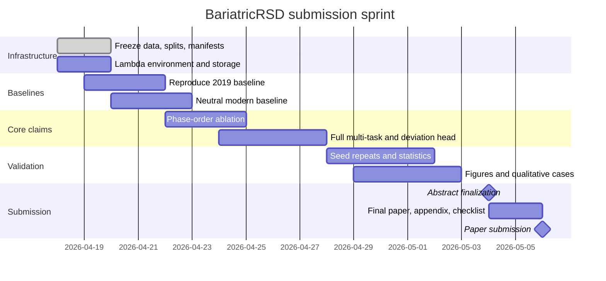

# NeurIPS Publication Plan for BariatricRSD

## Executive summary

Your project is already closer to a credible submission than it may feel. The uploaded materials show three things very clearly: you had a real 2019 signal, not just a vague idea; you already discovered a substantive source of structure in Roux-en-Y gastric bypass videos through phase-order variability and post-hoc deviation heuristics; and you now have a draft and roadmap that sketch a much more modern framing around joint RSD prediction, deviation detection, and phase recognition with a hierarchical temporal model. The gap is not “coming up with a topic.” The gap is converting those ingredients into a paper whose *main intellectual contribution* is legible to NeurIPS reviewers. fileciteturn0file0 fileciteturn0file1 fileciteturn0file2

The strongest recommendation is to frame this as a **use-inspired main-track paper** with a general ML claim: *structured temporal prediction under workflow variability benefits from explicit phase-order conditioning, multi-task supervision, and rigorous cross-center evaluation*. If the method gains are strong and consistent, submit to the main track. If the method gains are modest but your evaluation artifacts are excellent, pivot to the **Evaluations & Datasets** track, whose 2026 call explicitly says submissions need not introduce a new model or beat prior work, as long as they advance meaningful evaluation. citeturn16view0turn17view0turn17view1

The practical path is to spend your Lambda credits on a *small number of decisive experiments*, not on a sprawling sweep. The decisive evidence NeurIPS will care about is: a strong 2019-style baseline reproduced on clean splits; a no-phase-order modern baseline; a phase-order-conditioned version; a full multi-task version; and statistically defensible results across multiple seeds, centers, and phase-order clusters. NeurIPS’ current review form centers quality, clarity, significance, and originality, and the handbook explicitly notes that not all strong papers require massive compute if the contribution is clear and the evidence is sound. citeturn16view0turn15view0turn13search1

The deadline window is immediate. The official 2026 deadlines are **May 4, 2026 AoE for the abstract** and **May 6, 2026 AoE for the full paper including supplementary materials**, with notifications on **September 24, 2026 AoE**. Since today is April 17, 2026, you have roughly nineteen days to freeze the story, run the critical ablations, and convert the draft from a content outline into a submission-grade paper. citeturn12view0turn4view3turn17view0

## NeurIPS landscape

From 2022 through 2025, NeurIPS clearly expanded in both scale and scope. The official proceedings list **2,834 papers in 2022**, **3,540 papers in 2023**, and **4,493 papers in 2024**. The 2025 main-track review-process report says the conference received **21,575 valid submissions** and accepted **5,290 main-track papers**, a **24.52 percent** acceptance rate; the Datasets and Benchmarks chairs report that the 2024 D&B acceptance rate was **25.3 percent**, closely aligned with the main program’s **25.8 percent**. In other words, the venue is large, but it is not lax: the bar is now standardized around strong reviewing criteria and reproducibility expectations across tracks. citeturn8view0turn4view6turn4view7turn3search2turn10search0

The topical trendline is also clear. In 2022, official scope already included deep learning, applications, health sciences, infrastructure, and social aspects, while the accepted program prominently featured LLM alignment, zero-shot reasoning, multimodal models, and strong benchmark papers such as *Why do tree-based models still outperform deep learning on typical tabular data?* and *Flamingo*. In 2023 and 2024, the proceedings increasingly featured multimodal foundation models, video understanding, long-context evaluation, and diagnostic benchmarks such as *Perception Test*, *VideoStreaming*, *LongVideoBench*, *MMBench-Video*, and *HEMM*. By 2026, the official call names “AI/ML for health and biotechnology,” “language and multimodal language models,” “generalization and multi-task learning,” and “data-centric aspects of AI” as first-class topics. Your project sits at the intersection of *health*, *video*, *multi-task learning*, and *data-centric evaluation*, which is a genuine fit. citeturn4view5turn7search7turn7search2turn7search1turn6view1turn1search3turn5view2turn5view4turn12view0

What reviewers are being asked to reward is unusually explicit now. The current handbook’s review form scores papers on **quality**, **clarity**, **significance**, and **originality**, and the overall score definitions explicitly call out technical soundness, evaluation quality, reproducibility, resources, and whether ethical concerns are addressed. The handbook also states that originality does **not** require an entirely new method: new insights, stronger evaluation, improved efficiency, new problem framings, and unique data or conclusions can all count. That is excellent news for your project, because your strongest publishable claim may be a *new inductive bias plus unusually careful evaluation*, not a giant model. citeturn16view0turn15view0

Reviewer culture has also shifted toward evidence-backed criticism and away from penalizing honest limitations statements. The 2025 reviewer guidelines explicitly ask reviewers to make reviews informative and substantiated, to cite prior work when claiming lack of novelty, and to use the checklist constructively rather than punishing papers for acknowledging limitations or negative societal impact. For a medical AI paper, this means one practical rule: if your claims are measured, your splits are leakage-free, your uncertainty is calibrated, and your limitations are clearly disclosed, you materially improve your odds. citeturn4view1turn13search1turn12view2

A small primary-source packet you should actually read before submitting is this: the 2026 Call for Papers, the 2026 Main Track Handbook, the NeurIPS Paper Checklist guidance, the 2026 Evaluations & Datasets call and FAQ, the 2025 reviewer guidelines, and the 2022–2024 proceedings indexes for model papers and format calibration. These are the documents that define how your work will be judged. citeturn12view0turn15view0turn12view2turn17view0turn17view1turn13search1turn8view0turn4view6turn4view7

## Mapping the 2019 work into a publishable contribution

Your 2019 PDF is not dead prehistory. It already contains the seeds of a much stronger paper. The slide deck shows that you were not only predicting surgery progress with CNN and CNN+LSTM variants, but also exploring **phase-order clusters**, **cluster-specific training questions**, **time-as-input sequence models**, **bidirectional LSTMs**, **multiple-output losses**, and **post-hoc deviation detection** based on LOWESS or linear fits, hysteresis, interval sizing, and short-clip suppression. In other words, you had already discovered that workflow variability and residual structure matter. The modern version of the paper should present those 2019 findings not as a historical appendix, but as the empirical motivation for the new modeling choices. fileciteturn0file0

Your current draft pushes exactly in that direction. It proposes a multi-task Transformer with hierarchical temporal attention, a phase-order conditioning token, and three heads for RSD, deviation, and phase recognition, evaluated on Cholec80 and MultiBypass140. Your roadmap further implies that the codebase rewrite is largely done, that the training stack is modular, and that you already planned a Lambda setup script and week-by-week milestone structure. What is missing is not “another novel idea”; it is experimental focus, falsifiable hypotheses, and a credible contingency path if the method gains are smaller than hoped. fileciteturn0file1 fileciteturn0file2

There are several assumptions I have to make because the materials do not fully specify everything. I am assuming that your 2019 work used frame-wise or clip-wise normalized progress prediction from video and that at least some RYGB annotations exist for phases and adverse events; that the phase-order analysis is trustworthy enough to define cluster IDs or cluster-like pseudo-labels; that you can obtain or already have access to Cholec80 and MultiBypass140; that your updated codebase is executable on current PyTorch; and that your Lambda credit is enough for hundreds, not tens of thousands, of GPU-hours. Those assumptions are reasonable given the draft and roadmap, but each one should be checked in the next forty-eight hours. fileciteturn0file0 fileciteturn0file1 fileciteturn0file2

From those assumptions, there are three plausible NeurIPS-worthy directions.

The **recommended direction** is a **main-track use-inspired ML paper**. The contribution is not “we applied a transformer to surgery video.” The contribution is: *for structured long-horizon prediction tasks with heterogeneous workflows, explicit phase-order conditioning and multi-task supervision improve cross-case generalization and anomaly sensitivity over generic temporal models*. That claim is strong enough to matter beyond bariatric surgery, and the current main track explicitly welcomes use-inspired work, health and biotechnology work, and contributions whose novelty lies in new problem framings, evaluative claims, or combinations of techniques that are well justified. citeturn12view0turn16view0

The **first contingency direction** is an **Evaluations & Datasets paper**. If your model improvement over a strong baseline is real but small, you can still publish at NeurIPS by making the evaluation story the core contribution: cross-center splits, phase-order variability, deviation benchmarking, stress tests for workflow shift, failure analyses, and perhaps an operation-log utility study. The 2026 E&D call explicitly says submissions may present negative results, audits, refined evaluation setups, new protocols, or datasets that clarify how evaluative claims should be made; it also states that submissions need not introduce a new model or outperform prior work. citeturn17view0turn17view1

The **last-resort direction** is a more theory-leaning or methodology-heavy variant, but I do not recommend making that your primary plan on this timeline. A true theory paper would require formal claims about monotone progress constraints, cluster-conditioned temporal prediction, or uncertainty under workflow shift, and that is hard to do convincingly in nineteen days unless you already have a formal derivation in progress. You can still add lightweight method principles, such as monotonicity constraints, isotonic calibration, or uncertainty-aware loss weighting, but they should support the core empirical paper rather than become the main narrative. That recommendation is an inference from the venue criteria and your current materials. citeturn16view0turn15view0

For that reason, the paper should probably be titled and positioned around **structured temporal prediction under workflow variability**, not narrowly around “BariatricRSD” as an application brand. Keep the medical relevance because it differentiates the task, but make the claim transferable. That is the difference between a specialized application paper and a NeurIPS paper with a compelling application domain.

## Research questions and hypotheses

The central research question should be this: **Does explicit conditioning on workflow variation improve long-horizon temporal prediction and deviation detection in small, heterogeneous procedural video datasets?** This is the cleanest abstraction of what your 2019 work hinted at and what your current draft claims to solve. It is testable, methodologically meaningful, and aligned with current NeurIPS interest in multi-task learning, data-centric modeling, and evaluation under heterogeneity. fileciteturn0file0 fileciteturn0file1 citeturn12view0turn16view0

I would formalize the paper around five hypotheses.

**H1. Phase-order conditioning helps.** When evaluated on held-out videos and especially on held-out centers, a temporal model with explicit phase-order conditioning will improve video-level RSD MAE and deviation-detection F1 relative to the same model without conditioning. The most convincing version of this hypothesis is not the average gain alone, but the interaction effect: the improvement should be largest in minority or workflow-shifted orderings. That tests the actual causal story of the method rather than merely claiming a pooled gain.

**H2. Multi-task supervision helps sample efficiency and robustness.** A model trained jointly on RSD, phase recognition, and deviation detection will outperform or match task-specific models on the primary tasks while converging faster or requiring less data. This is especially plausible on small datasets because phase labels regularize temporal structure and deviation labels can force the model to represent unusual dynamics more distinctly. The key is to show either better data efficiency or better cross-center generalization, not just a tiny pooled test gain. fileciteturn0file1

**H3. Learned deviation detection beats post-hoc residual heuristics.** Your 2019 LOWESS/linear-fit plus hysteresis system should be retained as a baseline, but the modern deviation head should beat it on event-level precision-recall or segment-level F1, especially for subtle or temporally extended deviations where residual thresholding is brittle. This turns the 2019 work into a strong baseline instead of dead code. fileciteturn0file0

**H4. Domain-relevant pretraining or initialization helps when the bariatric dataset is small.** Compare ImageNet initialization, frozen feature extraction, and any available surgical or video-domain initialization. The important result is not simply “pretraining helps,” which is often unsurprising, but *whether phase-order conditioning still adds value after pretraining*. That avoids attributing everything to the encoder.

**H5. Calibration and uncertainty are part of the scientific claim.** A publishable medical ML paper should not only report point performance, but also whether confidence tracks error and whether drift or rare phase orders are detectable. If uncertainty estimates or calibration curves improve with phase-order conditioning or multi-tasking, that becomes a meaningful contribution in its own right because it links modeling structure to operational reliability.

Each hypothesis should be attached to a **single decisive figure or table** in the paper. If you cannot name the decisive artifact, the hypothesis is not yet sharp enough.

## Experimental program and Lambda budget

The right experimental design is a **funnel**: start with the fastest runs that can falsify the central claim, then only spend credits on broader sweeps if the signal survives. The roadmap you uploaded already leans this way, and that instinct is correct. fileciteturn0file2

The immutable design choices should be fixed immediately. Freeze the dataset versions, the split logic, the preprocessing pipeline, the evaluation scripts, and the definition of primary metrics before the first large run. Cholec80 should be the low-cost sanity benchmark, but MultiBypass140 or your closest RYGB benchmark must be the *scientific center of gravity* because that is where the phase-order story lives. If you mix internal and public data, your split table must make it impossible for a reviewer to suspect leakage across videos, surgeons, or centers. fileciteturn0file1

For models, I would organize the baselines into four tiers.

The first tier is **historical baselines**: your 2019 CNN-only, CNN+LSTM, and CNN+BiLSTM-with-time-input variants, plus the post-hoc LOWESS/linear residual deviation logic. Even if these are not SOTA, they are scientifically important because they are closest to the motivating idea and will make the improvement story much more credible. fileciteturn0file0

The second tier is **modern but neutral baselines**: a ResNet or video encoder plus LSTM/GRU/TCN/vanilla Transformer without phase-order conditioning. This tells reviewers whether the gains come from “any modern backbone” or from your specific idea.

The third tier is the **proposed family**: HTA or another hierarchical temporal backbone, with and without the phase-order token, and with single-task versus multi-task heads. This is where the critical ablation lives.

The fourth tier is **efficiency and reliability variants**: with and without uncertainty estimation, with and without monotonicity/progress constraints, and with different inference-time smoothing or calibration strategies. These are only worth pursuing once the core model wins.

The primary metrics should be defined at the **video level**, not only at the frame level. For RSD, report MAE in minutes and normalized MAE, plus Pearson or Spearman only as supporting correlation measures. For phase recognition, use macro-F1 rather than accuracy as the headline if classes are imbalanced. For deviation detection, use event- or segment-level F1, average precision, and latency-to-detection, because frame-level accuracy will be misleading on rare events. Calibration error and Brier score should be included for the deviation head if confidence scores are produced. These choices align with what reviewers will consider part of quality and significance. citeturn16view0

The most important ablations are not numerous. They are: **no phase-order token vs phase-order token**; **single-task vs multi-task**; **ImageNet or generic initialization vs surgery/video initialization**; **learned deviation head vs 2019 post-hoc heuristic**; **cross-center train/test vs random split**; and **performance by phase-order cluster frequency**. If those six comparisons are clean, the paper will read as focused rather than bloated.

A compact hyperparameter strategy is better than a giant sweep. Use a staged search: one short smoke run to validate loss stability; a coarse sweep on learning rate, clip length, and loss weights; then a single local search around the best setting. For example, limit the coarse sweep to learning rate in `{3e-5, 1e-4, 3e-4}`, clip length in `{16, 32}`, and deviation loss weight in `{0.1, 0.3, 0.5}`. Pick one optimizer family, probably AdamW, and do not burn credits on optimizer novelty unless the training is visibly unstable. Use early stopping and prune any run that is clearly inferior by one-third of the budgeted epochs. That is a much better use of credits than exhaustive search.

The table below is the experiment ladder I would actually run. The runtimes are **estimates**, based on your current architecture sketch, small-to-medium surgical video datasets, mixed precision, and current Lambda on-demand GPU prices of **$2.79 per A100 80GB GPU-hour**, **$1.99 per A100 40GB GPU-hour**, and **$3.99 per H100 80GB GPU-hour**. Convert your credit balance into wall-clock planning with:  
`wall_hours = credits / (price_per_gpu_hour × number_of_gpus)`. citeturn18search0turn18search2

| Variant | Purpose | Suggested hardware | Estimated GPU-hours | Approx. wall time | Approx. cost on A100 80GB | Priority |
|---|---|---:|---:|---:|---:|---|
| Smoke run on 10 videos | Verify data, loss, checkpoints, plots | 1× A100 | 4–6 | 4–6 h | $11–17 | Must do first |
| Reproduce 2019 CNN/BiLSTM baseline | Establish honest historical baseline | 1× A100 | 12–20 | 12–20 h | $33–56 | Critical |
| Neutral modern baseline without phase-order | Measure generic backbone gain | 1× A100 | 16–24 | 16–24 h | $45–67 | Critical |
| Cholec80 RSD-only modern run | Sanity-check temporal model | 1× A100 | 10–18 | 10–18 h | $28–50 | High |
| MultiBypass no phase-order, RSD+phase | Ablation anchor | 1× A100 | 18–28 | 18–28 h | $50–78 | Critical |
| MultiBypass with phase-order, RSD+phase | Test H1 directly | 1× A100 | 18–28 | 18–28 h | $50–78 | Critical |
| Full multi-task with deviation head | Test H2/H3 | 1× A100 | 20–32 | 20–32 h | $56–89 | Critical |
| Cluster-count sensitivity | Check whether 8 clusters is justified | 1× A100 | 24–40 | 24–40 h | $67–112 | Medium |
| Initialization comparison | Test encoder value-add | 1× A100 or 1× H100 | 20–36 | 20–36 h | $56–100 on A100 | Medium |
| Finalists, 3 seeds each | Statistical credibility | 1× A100 or 4× A100 | 90–150 | 90–150 h on 1 GPU, or 23–38 h on 4 GPUs | $251–419 | Non-negotiable |
| Final inference and figure regeneration | Produce paper artifacts | 1× A100 | 8–12 | 8–12 h | $22–33 | Non-negotiable |

A sensible total budget is therefore **240–390 A100 80GB GPU-hours** for a lean but credible submission, or **450–650 GPU-hours** for a stronger version with better repetition and one or two secondary ablations. At current Lambda pricing, that corresponds to roughly **$670–$1,090** for the lean path or **$1,255–$1,814** for the fuller path if everything is run on A100 80GB. If your credits are limited, the right optimization is not to skip the three-seed finals; it is to skip low-value sensitivity sweeps and use **1×A100 for most runs**, switching to **4×A100 only for the final two configurations** you already trust. citeturn18search0turn18search2turn16view0

Operationally, use Lambda in the simplest possible way. The official docs say you must first add an SSH key, then launch an instance from the console or API, and you can connect either by SSH or via the Cloud IDE/JupyterLab. Persistent filesystems should be created in the same region as the instance; the import/export guide should be your data movement playbook; and you should terminate instances from the console or API rather than trying to shut them down inside the OS, because billing otherwise may continue. citeturn19search3turn19search2turn19search5turn19search0turn18search16turn19search1turn18search7

Because your roadmap already mentions a `setup_lambda.sh` script, the fastest path is to treat Lambda as a **single-GPU reproducibility appliance**, not as a research playground. Create one base image or one repeatable setup script, attach one filesystem, store all configs and outputs under timestamped run directories, and run everything through `tmux` or a job wrapper so that disconnects never kill a run. Keep a plain-text “run ledger” in the repo root so that every table entry in the paper points back to a config file, commit hash, seed list, and checkpoint path. fileciteturn0file2

A minimal working launch routine looks like this:

```bash
# after SSHing into the instance
tmux new -s bariatric
git clone <your_repo_url> bariatric_rsd
cd bariatric_rsd
bash scripts/setup_lambda.sh
source .venv/bin/activate

# freeze metadata for every run
python -m bariatric_rsd.tools.write_run_manifest \
  --git-hash "$(git rev-parse HEAD)" \
  --seed 444 \
  --notes "phase-order ablation, no_pretrain"

# train
python -m bariatric_rsd.train \
  --config configs/multibypass_phaseorder.yaml \
  seed=444 output_dir=runs/2026-04-18_phaseorder_seed444

# evaluate + export publication artifacts
python -m bariatric_rsd.evaluate \
  --ckpt runs/2026-04-18_phaseorder_seed444/best.ckpt \
  --save_predictions --save_plots
```

That exact command set will need adaptation to your repo, but the discipline is the important part: **every run must be reproducible from one config and one command**.

## Statistical analysis and paper package

Your statistics section should be stronger than the median application paper. Do not let the reviewers do the statistical thinking for you. The primary analysis unit should be the **video**, not the frame. For RSD, compute video-level MAE and then compare paired methods over the same test videos using a paired permutation test or Wilcoxon signed-rank test, with 95 percent bootstrap confidence intervals. For deviation detection, evaluate both segment-level F1 and event-level average precision, again with stratified bootstrap intervals over videos. For phase recognition, provide macro-F1 and, if class imbalance is severe, a per-class table in the appendix. When you compare finalists, report **three seeds minimum** and show both the per-seed values and the aggregated mean and standard deviation. That is exactly the kind of rigor the checklist and the review form are designed to reward. citeturn12view2turn16view0

The most powerful visualization plan is one that makes each scientific claim visually obvious.

For **H1**, use a bar or dot plot of RSD MAE and deviation F1 by phase-order cluster, contrasting “no token” and “phase-order token.”  
For **H2**, use a sample-efficiency or training-curve plot showing RSD MAE versus fraction of training data for single-task and multi-task models.  
For **H3**, use a timeline figure over full surgeries comparing ground truth deviations, the 2019 hysteresis detector, and the learned deviation head.  
For **cross-center generalization**, use a train-center/test-center table plus a transfer-gap plot.  
For **reliability**, use calibration curves and risk-coverage or confidence-error plots.  
For **qualitative trustworthiness**, include 3–4 full-sequence case studies with phase bands, predicted progress, predicted remaining time, deviation probability, and errors.  

Those figures are much more persuasive than attention-map screenshots unless attention is itself a paper claim.

The workflow that best fits your story is:


And the actual calendar from today to the deadline should look like this:



The manuscript package should be assembled with the paper checklist in mind from the first day, not retrofitted in the last six hours. You need, at minimum, one architecture figure; one dataset/split table; one main-results table; one ablation table; one compute/cost table; one case-study figure; one calibration or error-analysis figure; and one appendix table defining all metrics, seeds, hardware, and hyperparameters. The 2026 main-track formatting rules keep the main text at **nine content pages** and require the checklist in the same PDF; Microsoft Word is discontinued, so you should port the current `.docx` draft to the official LaTeX template immediately rather than in the final week. citeturn15view0turn12view2

The ethical section is not optional window dressing here. Because this is healthcare video, you should explicitly cover privacy safeguards, consent or licensing status, cross-center representativeness limits, failure modes, false alarms versus missed deviations, and the fact that operation logging is a decision-support artifact rather than a clinical decision-maker. The handbook specifically calls out privacy, consent, representativeness, security, discrimination in services such as healthcare, secure data storage, and sufficient disclosure for reproducibility. A careful ethics paragraph will help you, not hurt you. citeturn15view0

For writing models, I would study these NeurIPS papers not for topical similarity alone, but for structure. *Why do tree-based models still outperform deep learning on typical tabular data?* is a strong model for benchmark-driven, careful empirical argument. *Perception Test* is a good model for diagnostic evaluation framing. *VideoStreaming* and *Video Token Merging for Long Video Understanding* are useful for long-video motivation, efficiency framing, and sequencing the method story. *HEMM* is a useful model if you decide to emphasize evaluation quality and multimodal reliability. citeturn7search7turn6view1turn1search3turn5view0turn5view4

## Risks, contingencies, and calendar to submission

The biggest risk is not that the model fails completely. The biggest risk is that the paper lands in the “interesting application, unclear general ML contribution” bucket. The way to reduce that risk is to make the transferable claim explicit in the title, abstract, introduction, and ablation design. If the paper still reads like “we built a system for bariatric surgery,” it will be much harder to sell than “we study structured temporal prediction under workflow variability and show that explicit workflow conditioning improves generalization on a real long-form video domain.” That wording choice is part of the science communication, not just style. citeturn16view0turn12view0

The second major risk is that the phase-order token yields only marginal gains. If that happens, do not hide it. Instead, test whether the gains are concentrated in rare or shifted clusters, whether calibration improves, or whether cross-center robustness improves even when pooled MAE barely moves. A small average gain with a compelling mechanism story and clear subgroup pattern is far more publishable than a slightly larger pooled gain with no interpretability. If even that pattern fails, pivot the paper toward evaluation and submit to the Evaluations & Datasets track, where the contribution can be the benchmark and stress-test protocol rather than the headline model delta. citeturn17view0turn17view1turn16view0

The third risk is compute sprawl. Lambda pricing is transparent and per-minute, but the real danger is unforced waste: leaving instances up during writing, rerunning full training because manifests were sloppy, or doing wide sweeps before the central claim survives the first two ablations. The countermeasure is a credits policy: **15 percent** for setup/debug, **25 percent** for baselines, **35 percent** for the core ablations, **20 percent** for final three-seed replication, and **5 percent** as emergency reserve. If you are low on credits, cut optional sweeps, not seed repeats on the final method. citeturn18search0turn19search2turn19search3

The fourth risk is data or label quality. Your 2019 slides already note issues like multiple short overlapping phases and parsing concerns. That history matters. Before claiming any anomaly-detection result, audit a small stratified subset manually and write down the annotation failure modes. If the labels are noisy, say so and evaluate robustness to that noise. Reviewers are usually far more forgiving of acknowledged label quality issues than of unexplained instability. fileciteturn0file0

The actionable schedule from today is therefore very concrete.

**April 18–19:** freeze splits, manifests, and preprocessing; launch a single A100 instance; confirm that one end-to-end training/evaluation cycle runs; reproduce the 2019 baseline on a tiny subset, then on the real split.  
**April 20–22:** run the neutral modern baseline and the Cholec80 sanity experiment; decide whether the temporal backbone is stable enough to keep.  
**April 23–25:** run the decisive comparison of no phase-order versus phase-order on the RYGB benchmark; if the signal is absent, initiate the E&D contingency framing immediately.  
**April 26–28:** run the full multi-task version and compare against the 2019 post-hoc deviation detector; start generating publication-quality qualitative cases at the same time.  
**April 29–May 1:** repeat the top two models over three seeds; run statistical tests; generate final tables and appendix artifacts.  
**May 2–3:** lock the track choice, finalize the abstract, and port any remaining text into the official LaTeX template.  
**May 4:** submit the abstract and verify all authors have a valid entity["organization","OpenReview","peer review platform"] profile.  
**May 5–6:** finish the PDF, appendix, checklist, code/artifact links, and submit. citeturn12view0turn4view3turn19search3turn15view0

If I had to reduce all of this to the single highest-value experiment set, it would be this: **three-seed comparison on the same frozen RYGB split of**  
(1) your 2019 BiLSTM plus post-hoc detector,  
(2) a modern temporal baseline without phase-order conditioning, and  
(3) the full proposed model with phase-order conditioning and multi-task heads,  
with performance broken out by center and by phase-order cluster. If that package is clean, you have a real NeurIPS submission. If it is not, you still have a plausible Evaluations & Datasets paper if you turn the benchmark and failure analysis into the main contribution. That is the shortest path from “interesting project” to “publishable paper.”


WandB api key is: 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

